# Lesson 10.3 — Executive Presentation Craft

**Module:** 10  
**Duration:** ~20 minutes  
**Learning objectives:** M10-LO3

---

## Opening hook (NorthStar)

Fifteen minutes. Fifteen slides maximum. Ten minutes of questions. The constraint is the curriculum: executives live in constraints. Your craft is **hierarchy**, not volume.

---

## Learning outcomes

1. Build a ≤15-slide deck that matches the narrative arc.  
2. Time a presentation to 15 minutes with intentional pauses for asks.

---

## Key concepts

### Slide budget (recommended)

1. Title / role  
2. Stakes & outcomes  
3. Current-state diagnosis  
4. Top risks  
5. Target-state overview  
6. Key platform/integration choices  
7. Security & resilience posture  
8. AI governed approach (brief)  
9. 24-month roadmap waves  
10. Value vs. investment  
11. Governance model  
12. Trade-offs & alternatives  
13. Decision asks  
14. Risks & mitigations  
15. Appendix pointer / close  

### Visual rules

- One idea per slide  
- Diagrams over paragraph text  
- Numbers with units and date ranges  
- Fiction notice on title or closing slide  

### Timing

~55–65 seconds average per slide; spend more on asks and roadmap, less on title.

---

## Framework

See `student/templates/25-executive-presentation-outline.md` and `capstone/presentation-template/`.

---

## Common mistakes

- 28 slides “just in case”  
- Reading bullets  
- Hiding the ask on slide 14 without rehearsal  

---

## Discussion prompts

1. Which slide will you cut if over time at minute 12?  
2. How will you signal the ask visually?

---

## Diagram

```mermaid
gantt
  title 15-minute presentation budget
  dateFormat mm
  axisFormat %M
  section Talk
  Framing           :a1, 00, 02
  Diagnosis         :a2, after a1, 03
  Target+Journey    :a3, after a2, 05
  Guardrails        :a4, after a3, 02
  Asks+Close        :a5, after a4, 03
```

