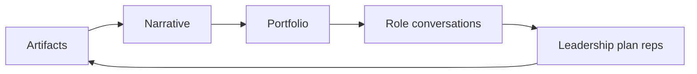

# Lesson 10.4 — Career Plan and Portfolio Leadership

**Module:** 10  
**Duration:** ~15 minutes  
**Learning objectives:** M10-LO4

---

## Opening hook (NorthStar)

The capstone is a fictional engagement. Your **portfolio** is the transferable asset: operating model, capability map, roadmap, ADRs, ARB memo, executive deck—labeled honestly as instructional work that demonstrates method.

---

## Learning outcomes

1. Assemble a portfolio narrative suitable for EA/staff+ interviews.  
2. Write a 12–24 month personal leadership plan with skills, sponsors, and practice reps.

---

## Key concepts

### Portfolio story

“I can translate strategy into architecture choices, govern decisions, and communicate with executives”—proved by artifacts, not titles.

### Leadership plan elements

- Target roles and environments  
- Skill gaps (influence, financial literacy, security depth, facilitation)  
- Practice reps (ARB volunteering, ADR coaching, exec memo writing)  
- Sponsors and feedback loops  
- Public sharing boundaries (fiction notice; no secrets)

---

## Framework

```text
Target role → Gaps → Reps → Artifacts → Feedback → Next role evidence
```

---

## Common mistakes

- Presenting NorthStar as a real employer engagement  
- Portfolio dump without narrative  
- Plan with goals but no calendarized reps  

---

## Discussion prompts

1. Which artifact best shows your trade-off leadership?  
2. What is one practice rep you will schedule in the next 30 days?

---

## Diagram


