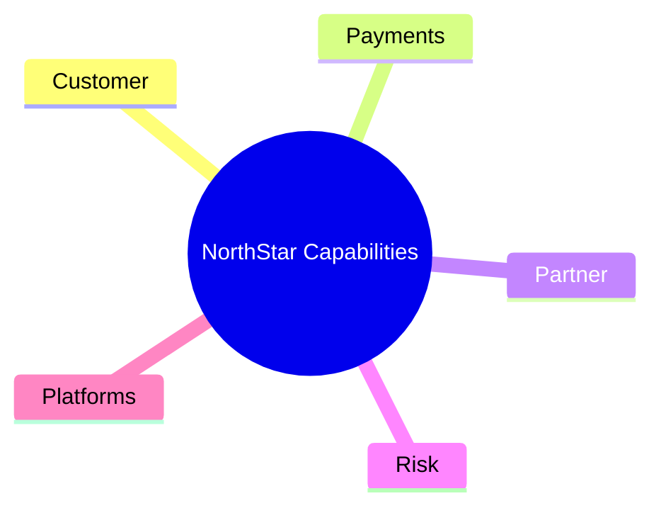

# Business Capability Map

**Organization:** NorthStar Financial Services (fictional)  
**Version:**  
**Authors:**  

> Capability = what the business does, independent of org chart or systems.

---

## Level 1 capability map

List 8–15 Level 1 capabilities. Mark Core / Supporting / Commodity.

| L1 ID | Capability | Type (Core/Supporting/Commodity) | Primary owner | Strategic relevance (H/M/L) |
| ----- | ---------- | -------------------------------- | ------------- | --------------------------- |
| C01 | | | | |
| C02 | | | | |
| C03 | | | | |
| C04 | | | | |
| C05 | | | | |
| C06 | | | | |
| C07 | | | | |
| C08 | | | | |
| C09 | | | | |
| C10 | | | | |

---

## Level 2 expansion (choose five L1s)

### {{L1 name}}

| L2 ID | Capability | Owner | Notes |
| ----- | ---------- | ----- | ----- |
| | | | |
| | | | |
| | | | |

*(Repeat for five L1 capabilities.)*

---

## Maturity scoring (1–5)

| Capability | Process | Data | Technology | People | Overall | Evidence |
| ---------- | ------: | ---: | ---------: | -----: | ------: | -------- |
| | | | | | | |

**Heatmap key:** 1–2 red · 3 amber · 4–5 green (customize legend as needed)

---

## Strategic gaps

| Gap | Related capabilities | Business impact | Architecture response theme |
| --- | -------------------- | --------------- | --------------------------- |
| | | | |

---

## KPI mapping

| KPI | Capability | Current | Target | Architecture dependency |
| --- | ---------- | ------- | ------ | ----------------------- |
| | | | | |

---

## Mermaid sketch (optional)

