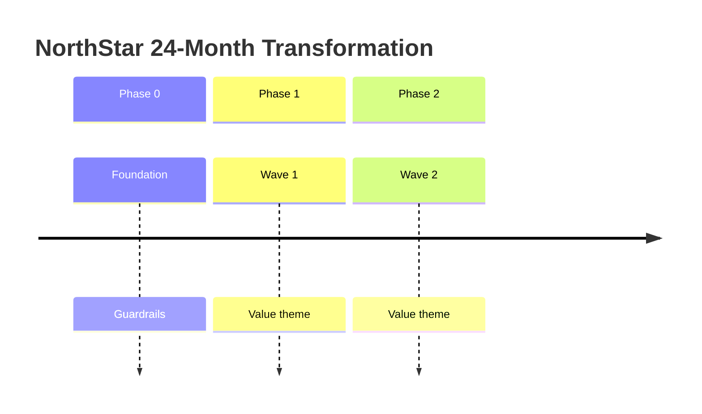

# Architecture Roadmap Template

**Organization:** NorthStar Financial Services (fictional)  
**Horizon:** 24 months (default)  
**Version:**  

---

## Vision statement (3–5 lines)

## Guiding principles for sequencing

1.  
2.  
3.  

---

## Waves / phases

| Phase | Timebox | Theme | Business value | Risk reduced | Major deliverables | Dependencies | Funding note |
| ----- | ------- | ----- | -------------- | ------------ | ------------------ | ------------ | ------------ |
| 0 Foundation | | | | | | | |
| 1 | | | | | | | |
| 2 | | | | | | | |
| 3 | | | | | | | |

---

## Transition states

| State | Description | Exit criteria |
| ----- | ----------- | ------------- |
| Current | | |
| Transition A | | |
| Transition B | | |
| Target | | |

---

## Initiative backlog (roadmap items)

| ID | Initiative | Capability | TIME link | Phase | Owner | Value hypothesis | Key risk |
| -- | ---------- | ---------- | --------- | ----- | ----- | ---------------- | -------- |
| | | | | | | | |

---

## Value-versus-risk matrix (plot notes)

| Initiative | Value (1–5) | Risk reduction (1–5) | Effort (1–5) | Priority |
| ---------- | ----------: | -------------------: | -----------: | -------- |
| | | | | |

---

## Executive milestone calendar

| Milestone | Date | Decision needed | Success signal |
| --------- | ---- | --------------- | -------------- |
| | | | |

## Mermaid timeline (optional)

