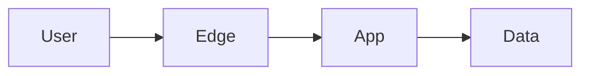

# Threat Model Worksheet

**System / platform:**  
**Organization:** NorthStar Financial Services (fictional)  
**Data classification:** Public | Internal | Confidential | Restricted  
**Authors:**  
**Date:**  

---

## 1. Scope and assets

| Asset | Description | Sensitivity | Owner |
| ----- | ----------- | ----------- | ----- |
| | | | |

## 2. Trust boundaries

Describe or diagram entry points, zones, and trust changes.

## 3. STRIDE checklist (overview)

| Threat category | Relevant? | Example abuse case | Existing control | Gap | Compensating control |
| --------------- | --------- | ------------------ | ---------------- | --- | -------------------- |
| Spoofing | | | | | |
| Tampering | | | | | |
| Repudiation | | | | | |
| Information disclosure | | | | | |
| Denial of service | | | | | |
| Elevation of privilege | | | | | |

## 4. Priority risks

| ID | Risk | Impact | Likelihood | Treatment |
| -- | ---- | ------ | ---------- | --------- |
| | | | | |

## 5. Residual risk acceptance

| Risk ID | Accepted by | Conditions | Review date |
| ------- | ----------- | ---------- | ----------- |
| | | | |
