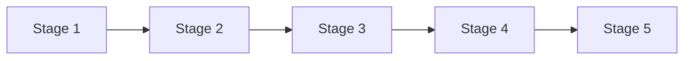

# Value Stream Map

**Organization:** NorthStar Financial Services (fictional)  
**Value stream name:**  
**Primary stakeholder (who receives value):**  
**Version / date:**  
**Authors:**  

> Fiction notice: NorthStar is a fictional instructional case study.

---

## Trigger and outcome

| Element | Description |
| ------- | ----------- |
| Triggering event | |
| End outcome (value delivered) | |
| Primary KPI(s) | Current: ____ · Target: ____ |
| Related strategic theme(s) | |

---

## Stages

Map 5–8 stages. Keep stages outcome-oriented (not system steps).

| # | Stage name | Stage outcome | Entry criteria | Exit criteria | Lead time (approx.) | Wait / rework notes |
| - | ---------- | ------------- | -------------- | ------------- | ------------------- | ------------------- |
| 1 | | | | | | |
| 2 | | | | | | |
| 3 | | | | | | |
| 4 | | | | | | |
| 5 | | | | | | |
| 6 | | | | | | |

---

## Capability overlay

| Stage | Capabilities invoked (L1/L2) | Primary owner | Applications (evidence only) |
| ----- | ---------------------------- | ------------- | ---------------------------- |
| | | | |
| | | | |
| | | | |

---

## Friction register

Classify each friction: Data · Integration · Ownership · Control · Platform · Other

| ID | Stage | Friction | Class | Business impact | Architecture implication | Priority (H/M/L) |
| -- | ----- | -------- | ----- | --------------- | ------------------------ | ---------------- |
| F1 | | | | | | |
| F2 | | | | | | |
| F3 | | | | | | |
| F4 | | | | | | |

---

## Investment themes emerging from this stream

| Theme | Capabilities to uplift | Expected KPI movement | Explicit trade-off / delay |
| ----- | ---------------------- | --------------------- | -------------------------- |
| | | | |
| | | | |

---

## Mermaid sketch (optional)

---

## Assumptions

-
-
-
