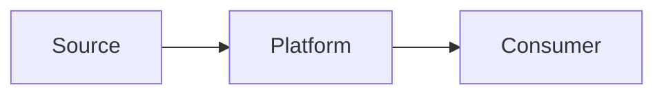

# Data Flow Diagram Template

**Organization:** NorthStar Financial Services (fictional)  
**Flow name:**  
**Owner:**  
**Date:**  

## Scope

## Actors / systems

| Actor | Role |
| ----- | ---- |
| | |

## Flow steps

| Step | From | To | Data | Pattern | Trust boundary |
| ---- | ---- | -- | ---- | ------- | -------------- |
| 1 | | | | | |

## Data classification

| Dataset | Classification | Encryption | Retention |
| ------- | -------------- | ---------- | --------- |
| | | | |

## Failure and replay

## Mermaid (optional)

