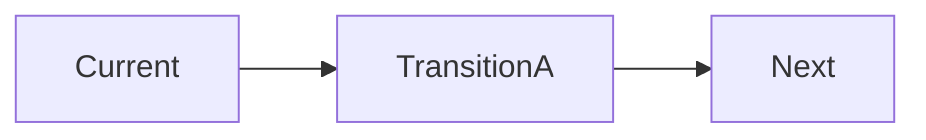

# Transition-State Plan Template

**Organization:** NorthStar Financial Services (fictional)  
**Module:** 04 — Target-State Architecture and Transformation Roadmaps  
**Author:**  
**Date / version:**  

> Fiction notice: NorthStar is an instructional case study.

---

## Purpose

Document interim architectures between current and target state, including coexistence patterns and **observable exit criteria**.

---

## Current-state summary (5–8 lines)

---

## Target-state headline (3–5 lines)

---

## Sequencing principles

1.  
2.  
3.  

---

## Transition A

| Field | Content |
| ----- | ------- |
| Name / theme | |
| Timebox | |
| Architecture headline | |
| Systems of record (interim) | |
| Coexistence patterns | |
| Security / identity / audit notes | |
| Major initiatives in this state | |
| Exit criteria (observable) | |
| Risks unique to this state | |
| Decisions required | |

### Transition A diagram (optional)

---

## Transition B

| Field | Content |
| ----- | ------- |
| Name / theme | |
| Timebox | |
| Architecture headline | |
| Systems of record (interim) | |
| Coexistence patterns | |
| Security / identity / audit notes | |
| Major initiatives in this state | |
| Exit criteria (observable) | |
| Risks unique to this state | |
| Decisions required | |

---

## Transition C

| Field | Content |
| ----- | ------- |
| Name / theme | |
| Timebox | |
| Architecture headline | |
| Systems of record (interim) | |
| Coexistence patterns | |
| Security / identity / audit notes | |
| Major initiatives in this state | |
| Exit criteria (observable) | |
| Risks unique to this state | |
| Decisions required | |

---

## Dependency map (A → B → C)

| From | To | Dependency | If late, impact |
| ---- | -- | ---------- | --------------- |
| A | B | | |
| B | C | | |

---

## Temporary interfaces register

| Interface / bridge | Purpose | Owner | End date / exit link | Risk if extended |
| ------------------ | ------- | ----- | -------------------- | ---------------- |
| | | | | |

---

## Assumptions

## Open questions

