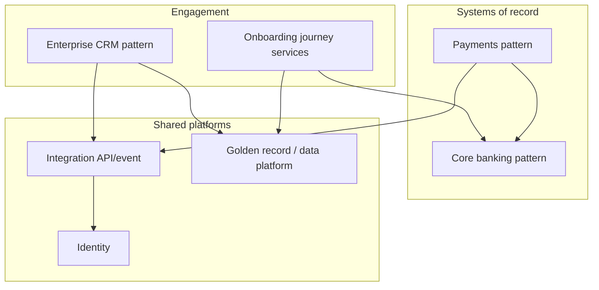

# Target-State Architecture Template

**Organization:** NorthStar Financial Services (fictional)  
**Module:** 04 — Target-State Architecture and Transformation Roadmaps  
**Horizon:** 24–36 months (state which)  
**Author:**  
**Date / version:**  

> Fiction notice: NorthStar is an instructional case study.

---

## 1. Executive outcome statement

What will be true if the target state is substantially achieved?

---

## 2. Strategic capabilities

| Capability | Invest / Sustain / Exit | Target pattern (1 sentence) | Primary owner |
| ---------- | ----------------------- | --------------------------- | ------------- |
| | | | |
| | | | |
| | | | |
| | | | |
| | | | |
| | | | |

---

## 3. Target principles

| # | Principle | Implication | Valid exception |
| - | --------- | ----------- | --------------- |
| 1 | | | |
| 2 | | | |
| 3 | | | |
| 4 | | | |
| 5 | | | |
| 6 | | | |
| 7 | | | |

---

## 4. Constraints and non-goals

### Constraints

### Non-goals (next 24 months)

---

## 5. Target application architecture (pattern-level)

### Narrative

### Pattern table

| Domain | Target pattern | System of record / engagement | Shared platform dependency |
| ------ | -------------- | ----------------------------- | -------------------------- |
| Customer engagement | | | |
| Onboarding | | | |
| Payments | | | |
| Partner integration | | | |
| Core banking / ledger | | | |
| Identity | | | |
| Data / golden record | | | |
| Observability / ops | | | |

### Diagram

---

## 6. Application / platform dispositions

| App or group | Retain / Replace / Consolidate / Retire | Execution note (rehost/replatform/refactor) | Dual-run? | Rationale |
| ------------ | --------------------------------------- | ------------------------------------------- | --------- | --------- |
| | | | | |
| | | | | |
| | | | | |
| | | | | |
| | | | | |
| | | | | |
| | | | | |
| | | | | |

---

## 7. Security, resilience, and compliance posture (target)

| Concern | Target expectation |
| ------- | ------------------ |
| Identity | |
| Data protection | |
| Audit evidence | |
| RTO/RPO class (critical journeys) | |

---

## 8. Operating model implications

- ARB / exception handling:  
- Platform golden paths:  
- Funding / chargeback notes:  

---

## 9. Assumptions

## 10. Trade-off summary

| Option considered | Why not chosen | Consequence accepted |
| ----------------- | -------------- | -------------------- |
| | | |
| | | |

---

## Related artifacts

- Transition-state plan (template 23)  
- Architecture roadmap (template 09)  
