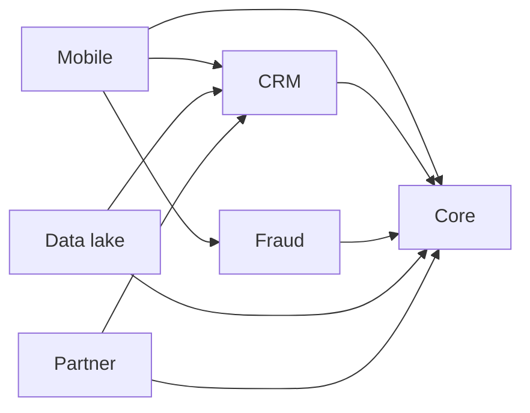
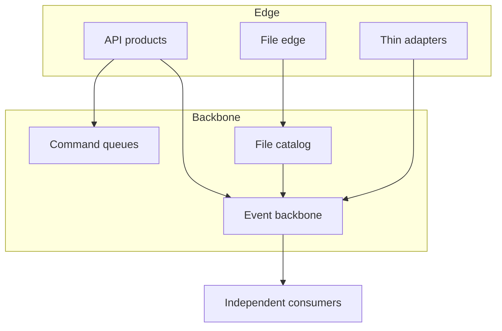

# Diagram 1 — Point-to-point vs integration styles

## Point-to-point mesh (avoid at scale)

```mermaid
flowchart LR
  A[Mobile] --> B[Core]
  A --> C[CRM]
  A --> D[Fraud]
  C --> B
  D --> B
  E[Data lake] --> B
  E --> C
  P[Partner] --> B
  P --> C
```

## Style-based platform

```mermaid
flowchart TB
  subgraph Edge
    API[API products]
    SFTP[File edge]
    Ad[Thin adapters]
  end
  subgraph Backbone
    Q[Command queues]
    Bus[Event backbone]
    Cat[File catalog]
  end
  API --> Q
  API --> Bus
  SFTP --> Cat
  Cat --> Bus
  Ad --> Bus
  Bus --> Cons[Independent consumers]
```
