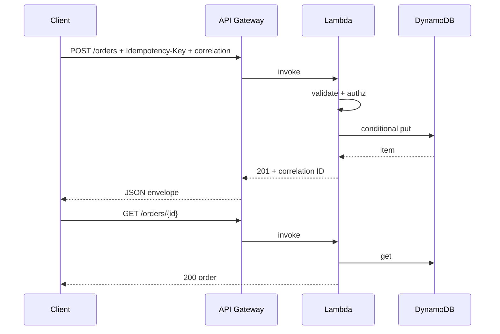
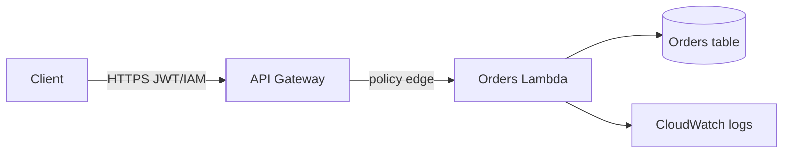

# Diagram 2 — API integration

```mermaid
sequenceDiagram
  participant Client
  participant GW as API Gateway
  participant Fn as Lambda
  participant DB as DynamoDB
  Client->>GW: POST /orders + Idempotency-Key + correlation
  GW->>Fn: invoke
  Fn->>Fn: validate + authz
  Fn->>DB: conditional put
  DB-->>Fn: item
  Fn-->>GW: 201 + correlation ID
  GW-->>Client: JSON envelope
  Client->>GW: GET /orders/{id}
  GW->>Fn: invoke
  Fn->>DB: get
  Fn-->>Client: 200 order
```

```mermaid
flowchart LR
  C[Client] -->|HTTPS JWT/IAM| GW[API Gateway]
  GW -->|policy edge| Fn[Orders Lambda]
  Fn --> DB[(Orders table)]
  Fn --> Logs[CloudWatch logs]
```
