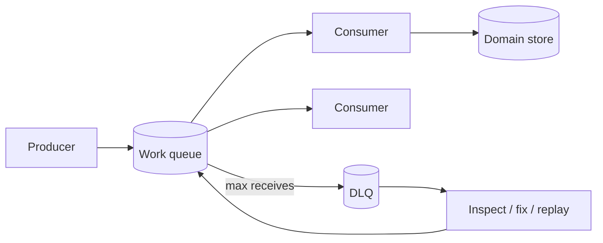

# Diagram 3 — Queue architecture

```mermaid
flowchart LR
  P[Producer] --> Q[(Work queue)]
  Q --> C1[Consumer]
  Q --> C2[Consumer]
  Q -->|max receives| DLQ[(DLQ)]
  C1 --> DB[(Domain store)]
  DLQ --> Ops[Inspect / fix / replay]
  Ops --> Q
```
