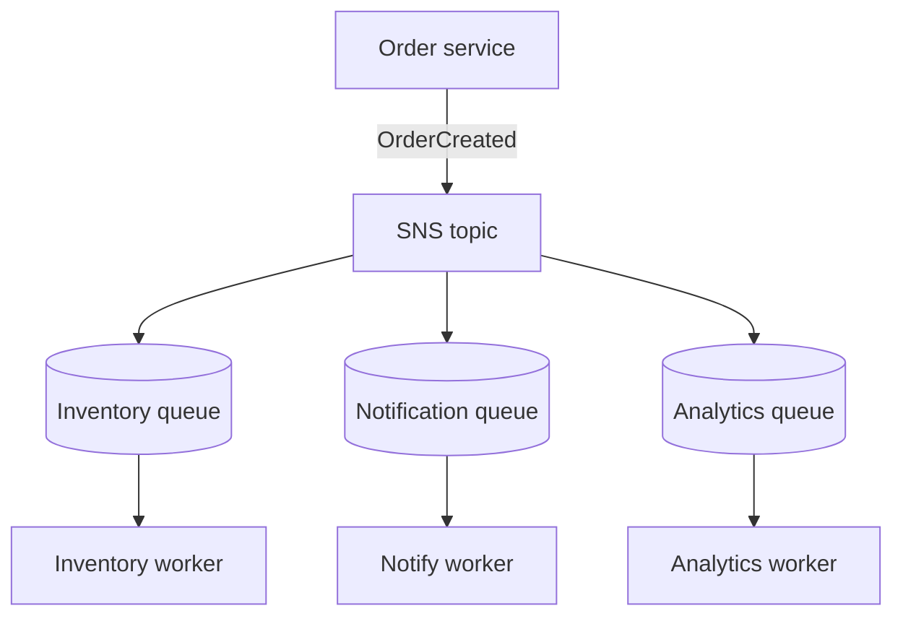

# Diagram 4 — Pub/sub architecture

```mermaid
flowchart TB
  Pub[Order service] -->|OrderCreated| T[SNS topic]
  T --> Q1[(Inventory queue)]
  T --> Q2[(Notification queue)]
  T --> Q3[(Analytics queue)]
  Q1 --> I[Inventory worker]
  Q2 --> N[Notify worker]
  Q3 --> A[Analytics worker]
```
