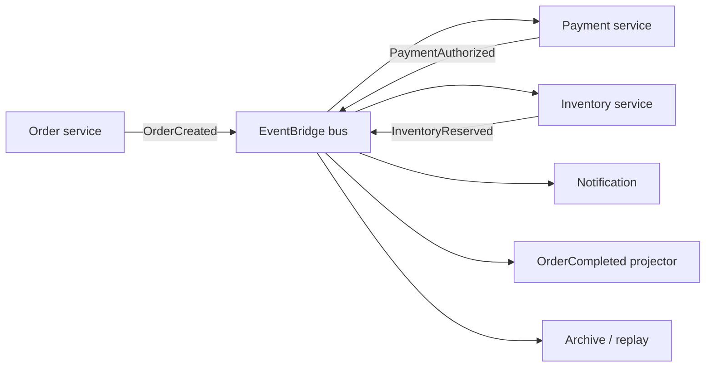

# Diagram 5 — Event-driven architecture

```mermaid
flowchart LR
  OS[Order service] -->|OrderCreated| Bus[EventBridge bus]
  Bus --> Pay[Payment service]
  Pay -->|PaymentAuthorized| Bus
  Bus --> Inv[Inventory service]
  Inv -->|InventoryReserved| Bus
  Bus --> N[Notification]
  Bus --> Done[OrderCompleted projector]
  Bus --> Arch[Archive / replay]
```
