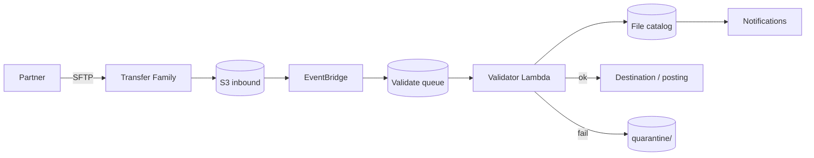

# Diagram 6 — File-transfer architecture

```mermaid
flowchart LR
  Partner -->|SFTP| TF[Transfer Family]
  TF --> S3[(S3 inbound)]
  S3 --> EB[EventBridge]
  EB --> Q[(Validate queue)]
  Q --> V[Validator Lambda]
  V --> Cat[(File catalog)]
  V -->|ok| Dest[Destination / posting]
  V -->|fail| Quarantine[(quarantine/)]
  Cat --> N[Notifications]
```
