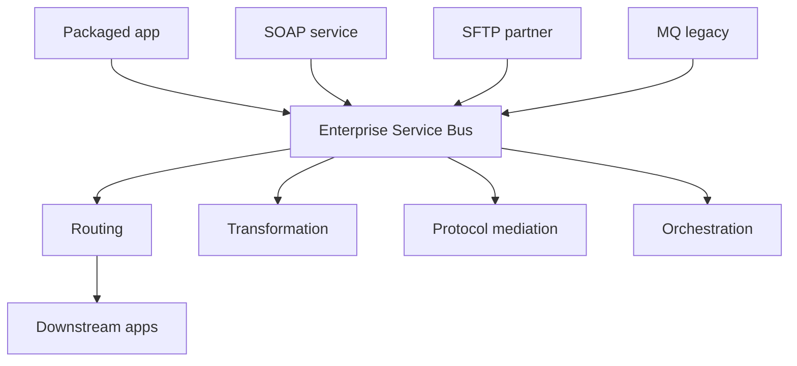

# Diagram 7 — ESB architecture

```mermaid
flowchart TB
  A[Packaged app] --> ESB[Enterprise Service Bus]
  B[SOAP service] --> ESB
  C[SFTP partner] --> ESB
  D[MQ legacy] --> ESB
  ESB --> R[Routing]
  ESB --> T[Transformation]
  ESB --> M[Protocol mediation]
  ESB --> O[Orchestration]
  R --> X[Downstream apps]
```
