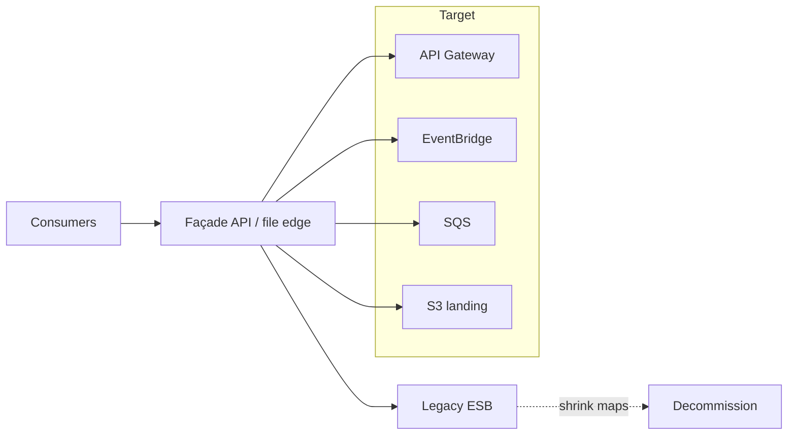

# Diagram 8 — ESB modernization (strangler)

```mermaid
flowchart LR
  Cons[Consumers] --> F[Façade API / file edge]
  F --> ESB[Legacy ESB]
  F --> API[API Gateway]
  F --> Bus[EventBridge]
  F --> Q[SQS]
  F --> S3[S3 landing]
  ESB -.->|shrink maps| X[Decommission]
  subgraph Target
    API
    Bus
    Q
    S3
  end
```
