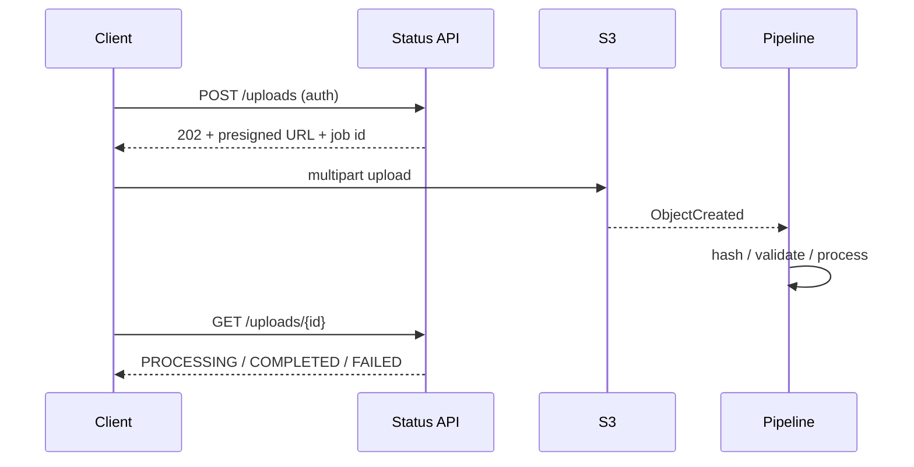

# Diagram 9 — Large-file architecture

```mermaid
sequenceDiagram
  participant C as Client
  participant A as Status API
  participant S as S3
  participant P as Pipeline
  C->>A: POST /uploads (auth)
  A-->>C: 202 + presigned URL + job id
  C->>S: multipart upload
  S-->>P: ObjectCreated
  P->>P: hash / validate / process
  C->>A: GET /uploads/{id}
  A-->>C: PROCESSING / COMPLETED / FAILED
```
