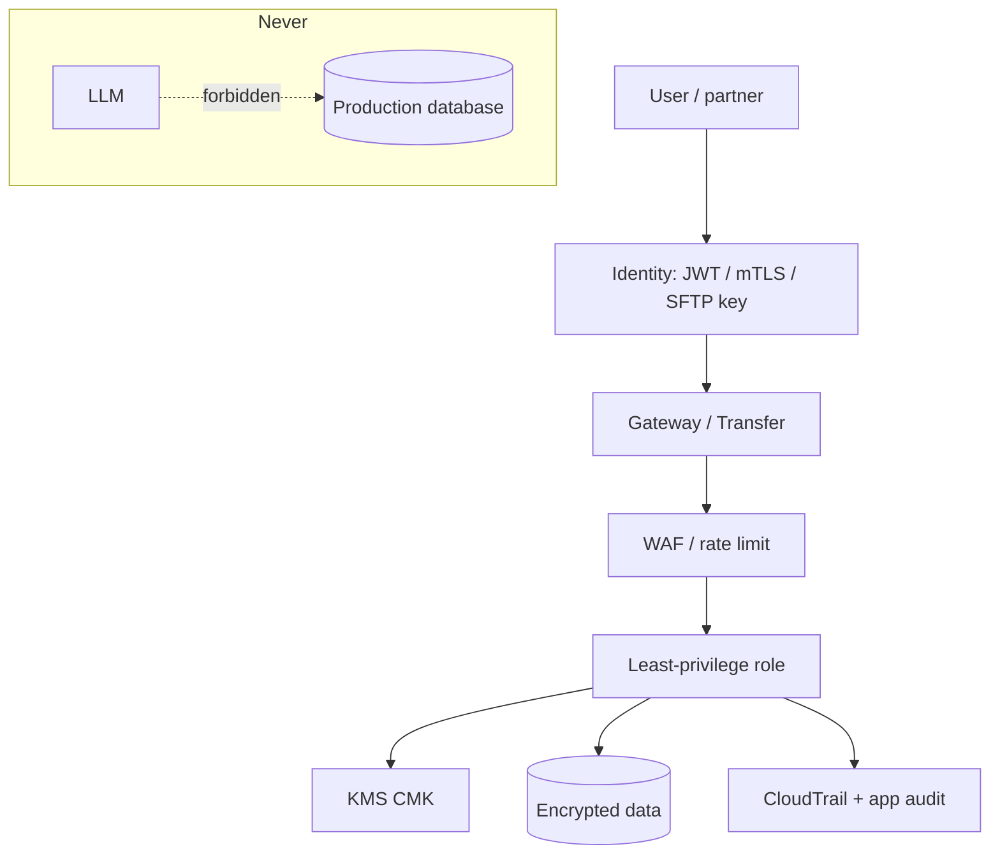

# Diagram 10 — Integration security

```mermaid
flowchart TB
  U[User / partner] --> Id[Identity: JWT / mTLS / SFTP key]
  Id --> Edge[Gateway / Transfer]
  Edge --> WAF[WAF / rate limit]
  WAF --> Svc[Least-privilege role]
  Svc --> KMS[KMS CMK]
  Svc --> Data[(Encrypted data)]
  Svc --> Trail[CloudTrail + app audit]
  subgraph Never
    LLM[LLM] -.->|forbidden| DB[(Production database)]
  end
```
