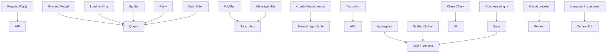

# Module 10 — pattern map

```mermaid
flowchart TB
  RR[Request/Reply] --> API[API]
  FF[Fire and Forget] --> Q[Queue]
  LL[Load leveling] --> Q
  PS[Pub/Sub] --> T[Topic / bus]
  CBR[Content-based router] --> Bus[EventBridge / table]
  MF[Message filter] --> T
  MT[Translator] --> ACL[ACL]
  AG[Aggregator] --> SF[Step Functions]
  SP[Splitter] --> Q
  SG[Scatter/Gather] --> SF
  CC[Claim Check] --> S3[S3]
  SA[Saga] --> SF
  CB[Circuit breaker] --> App[Worker]
  RT[Retry] --> Q
  DLQ[Dead letter] --> Q
  IC[Idempotent consumer] --> DDB[DynamoDB]
  CT[Compensating tx] --> SA
```
