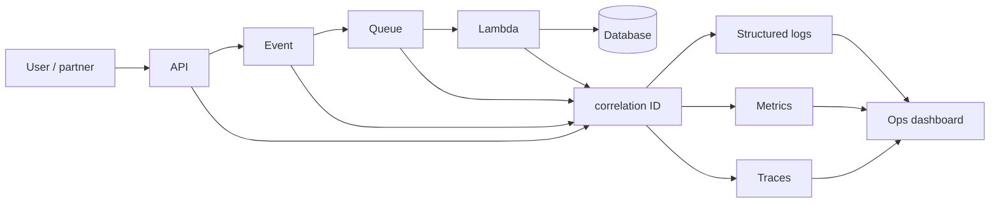

# Diagram 11 — Integration observability

```mermaid
flowchart LR
  Req[User / partner] --> API[API]
  API --> Ev[Event]
  Ev --> Q[Queue]
  Q --> Fn[Lambda]
  Fn --> DB[(Database)]
  API --> CID[correlation ID]
  Ev --> CID
  Q --> CID
  Fn --> CID
  CID --> Logs[Structured logs]
  CID --> Met[Metrics]
  CID --> Tr[Traces]
  Logs --> Dash[Ops dashboard]
  Met --> Dash
  Tr --> Dash
```
