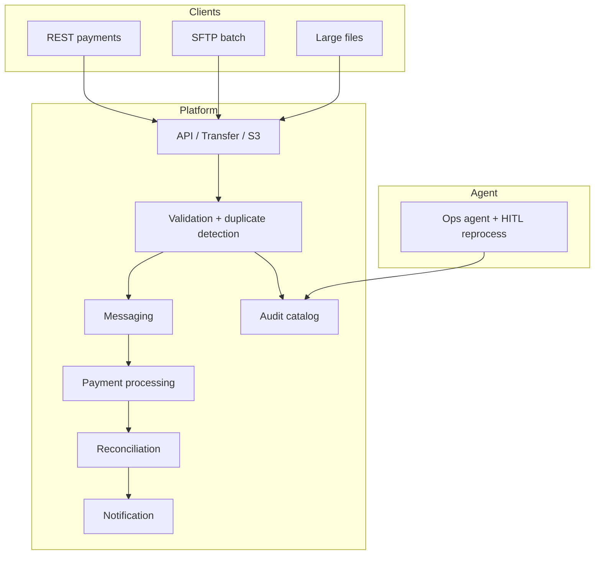

# Diagram 13 — Banking capstone (student designs details)

```mermaid
flowchart TB
  subgraph Clients
    API[REST payments]
    SFTP[SFTP batch]
    Large[Large files]
  end
  subgraph Platform
    Edge[API / Transfer / S3]
    Val[Validation + duplicate detection]
    Msg[Messaging]
    Pay[Payment processing]
    Rec[Reconciliation]
    N[Notification]
    Cat[Audit catalog]
  end
  API --> Edge
  SFTP --> Edge
  Large --> Edge
  Edge --> Val
  Val --> Msg
  Msg --> Pay
  Pay --> Rec
  Rec --> N
  Val --> Cat
  subgraph Agent
    Ops[Ops agent + HITL reprocess]
  end
  Ops --> Cat
```
