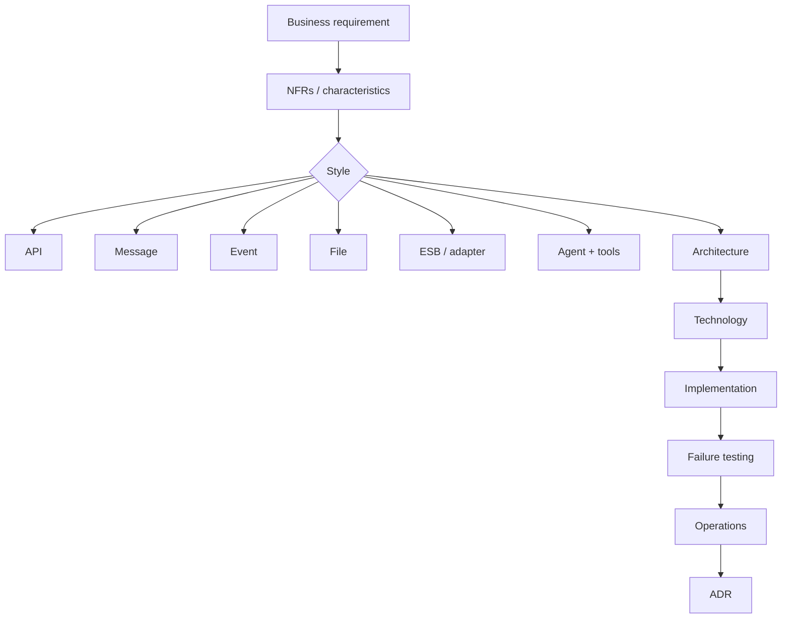

# Diagram — decision framework

```mermaid
flowchart TD
  BR[Business requirement] --> NFR[NFRs / characteristics]
  NFR --> ST{Style}
  ST --> API[API]
  ST --> MSG[Message]
  ST --> EV[Event]
  ST --> FILE[File]
  ST --> ESB[ESB / adapter]
  ST --> AI[Agent + tools]
  ST --> AR[Architecture]
  AR --> TE[Technology]
  TE --> IM[Implementation]
  IM --> FT[Failure testing]
  FT --> OP[Operations]
  OP --> ADR[ADR]
```
