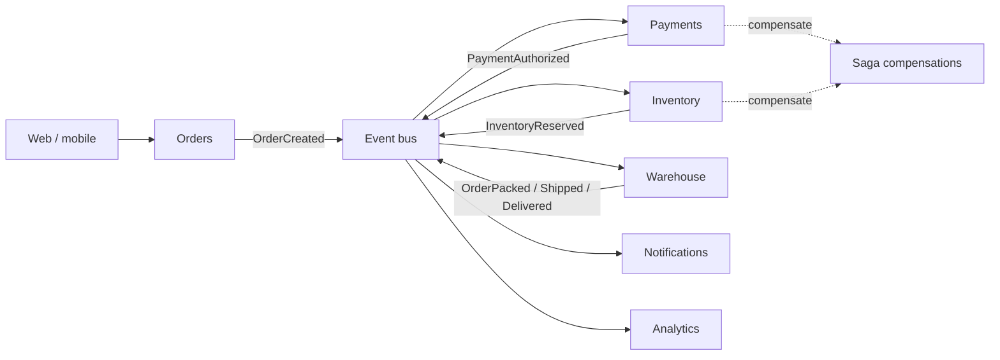

# Diagram 14 — E-commerce capstone (saga + events)

```mermaid
flowchart LR
  Web[Web / mobile] --> Orders
  Orders -->|OrderCreated| Bus[Event bus]
  Bus --> Pay[Payments]
  Pay -->|PaymentAuthorized| Bus
  Bus --> Inv[Inventory]
  Inv -->|InventoryReserved| Bus
  Bus --> Wh[Warehouse]
  Wh -->|OrderPacked / Shipped / Delivered| Bus
  Bus --> N[Notifications]
  Bus --> An[Analytics]
  Pay -.->|compensate| Saga[Saga compensations]
  Inv -.->|compensate| Saga
```
