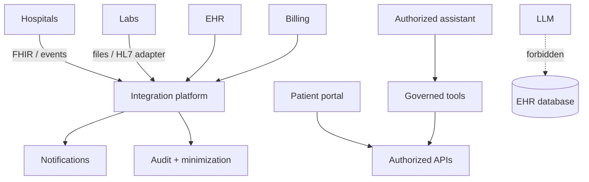

# Diagram 15 — Healthcare capstone (FHIR-level)

```mermaid
flowchart TB
  Portal[Patient portal] --> APIs[Authorized APIs]
  Hosp[Hospitals] -->|FHIR / events| Plat[Integration platform]
  Lab[Labs] -->|files / HL7 adapter| Plat
  EHR[EHR] --> Plat
  Bill[Billing] --> Plat
  Plat --> Notif[Notifications]
  Plat --> Audit[Audit + minimization]
  Ag[Authorized assistant] --> Tools[Governed tools]
  Tools --> APIs
  LLM[LLM] -.->|forbidden| EHRDB[(EHR database)]
```
