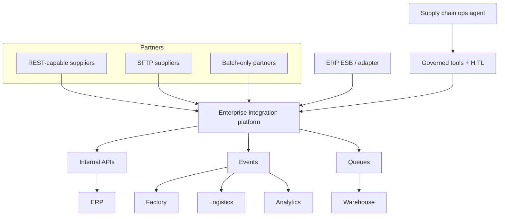

# Diagram 16 — Manufacturing / supply chain capstone

```mermaid
flowchart TB
  subgraph Partners
    REST[REST-capable suppliers]
    SFTP[SFTP suppliers]
    Batch[Batch-only partners]
  end
  REST --> EIP[Enterprise integration platform]
  SFTP --> EIP
  Batch --> EIP
  Ad[ERP ESB / adapter] --> EIP
  EIP --> API[Internal APIs]
  EIP --> EV[Events]
  EIP --> Q[Queues]
  API --> ERP[ERP]
  EV --> Fac[Factory]
  Q --> WH[Warehouse]
  EV --> Log[Logistics]
  EV --> An[Analytics]
  Ag[Supply chain ops agent] --> Tools[Governed tools + HITL]
  Tools --> EIP
```
