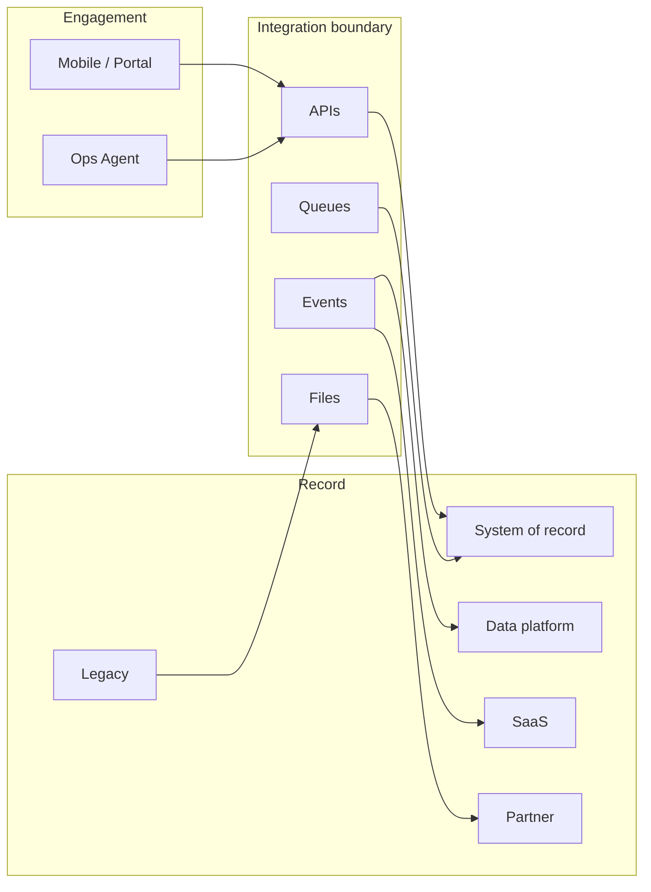

# Lesson 1.1 — What Is Enterprise Integration?

**Module:** 01 — Enterprise Integration Fundamentals  
**Duration:** 25–35 minutes  
**BayLearn philosophy:** WHY → WHEN → HOW. Pattern first. Technology second.

---

## Learning outcomes

By the end of this lesson you will be able to:

1. Define enterprise integration as the governed exchange of data and commands across ownership boundaries.
2. Name the typical systems that sit on either side of an integration: systems of record, SaaS, partners, data platforms, legacy, and cloud.
3. Draw an integration boundary and explain who owns availability, schema, and security on each side.

---

## Enterprise scenario

Northbridge Bank runs a core banking system of record, a cloud CRM, a partner-bank settlement network, a data lake, a 1990s loan origination mainframe, and a mobile app. The CIO asks you to “connect everything.” That request is not an architecture. Enterprise integration starts by naming systems, ownership, and the boundary where a message, file, API call, or event actually crosses from one team’s control to another.

> **Fiction notice:** Named companies in this course (Northbridge Bank, Harbor Retail, CareMesh Health, Atlas Manufacturing) are instructional fictions.

---

## WHY this exists

Enterprises do not fail because they lack HTTP clients. They fail because customer, payment, inventory, and partner data live in different applications with different owners, SLAs, and regulatory constraints. Integration is the discipline of moving meaning—not just bytes—across those boundaries without creating an unmaintainable mesh of hidden dependencies.

A **system of record** is the authoritative store for a business entity (the ledger for an account balance). A **system of engagement** (mobile, portal, chatbot) should not become a second system of record. SaaS products you do not operate still sit inside your architecture the moment you depend on their APIs. Partners are other enterprises: they will not adopt your internal event bus. Data platforms consume integration output; they are rarely the operational path for a payment. Legacy applications often expose files or MQ rather than REST. Cloud systems add identity, network, and account boundaries on top of all of this.

---

## WHEN an Enterprise Architect uses it

- You must exchange data or trigger work across applications, teams, companies, or cloud accounts.
- A business process spans more than one system of record.
- A partner, regulator, or SaaS vendor owns part of the workflow.
- You are defining an integration inventory before selecting technology.

### When NOT to use it

- The work is a local function call inside a single service and bounded context.
- You are only replicating data for analytics with no operational contract (that is still integration, but a different style—batch/CDC—do not pretend it is a real-time API).
- You have not identified the owner of the contract. “Someone will write a Lambda” is not a boundary.

### Integration characteristics to inspect

- Volume and payload size
- Latency (synchronous human wait vs overnight batch)
- Reliability and whether loss is acceptable
- Security classification and who may see the payload
- Ownership of schema and versioning

---

## HOW — the pattern (vendor-neutral)

Start with an **integration inventory**: source, destination, data subject, direction, frequency, payload shape, sensitivity, and failure impact. Draw the **trust boundary**: identity, network, and data classification change at that line. Then classify the interaction as command (do this), query (tell me this), event (this happened), or batch (here is a set).

Only after the inventory is honest do you choose API, message, event, file, adapter, or agent. The inventory is the architect’s primary artifact in week one of any engagement.

### Architecture diagram

---

## HOW — AWS implementation (after the pattern)

AWS does not change the inventory. API Gateway might terminate an API boundary. SQS might hold a command. EventBridge might route a fact. S3 and Transfer Family might land a file. IAM and KMS implement the trust boundary. None of those services tell you whether the mobile app should call core banking synchronously for a 20 GB settlement file—that is still a bad idea on any cloud.

Do not start here. If you cannot explain the requirement and pattern without naming an AWS service, you are not ready to select technology.

---

## Anti-patterns

- Calling every HTTP call “the architecture.”
- Letting SaaS become an accidental system of record because it was easy to write to.
- Skipping partner constraints (“they will just use our Kafka”).

---

## Tradeoffs

| Dimension | Benefit | Cost / risk |
|-----------|---------|-------------|
| Clarity | Named boundaries make ownership and SLAs explicit | Inventory work feels slow to delivery teams |
| Coupling | Contracts localize change | Poor contracts recreate point-to-point chaos on new tech |
| Cost | Right-sized style avoids overbuilding | Wrong style (API for bulk files) creates outage and spend |

---

## Architecture decision prompt

Northbridge wants the mobile app, CRM, settlement partners, and the data lake to “see the same customer.” Is that one integration or four? Which are queries, which are events, which are files? Who owns the customer identifier?

Write four sentences: the requirement, the integration characteristics, the pattern, and why the rejected options fail the NFRs.

---

## Knowledge check

**Q1.** What is an integration boundary?

*Answer.* The line where control of identity, schema, availability, or data classification changes—typically between applications, teams, accounts, or organizations.

**Q2.** Why is a data lake rarely the system of record for a payment?

*Answer.* Operational correctness, latency, and legal authority live in the payment/ledger system. The lake is a consumer of facts, not the place you authorize a transfer.

---

## Architect's note

If you cannot list the systems of record and the owners, you are not designing an integration platform. You are decorating a mystery.

---

## Next

Complete any architecture challenge attached to this lesson in the course player. Record an ADR fragment if the decision would survive a design review.
