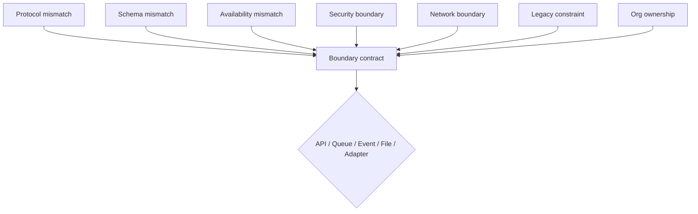

# Lesson 1.2 — Why Enterprise Integration Is Difficult

**Module:** 01 — Enterprise Integration Fundamentals  
**Duration:** 25–35 minutes  
**BayLearn philosophy:** WHY → WHEN → HOW. Pattern first. Technology second.

---

## Learning outcomes

By the end of this lesson you will be able to:

1. Explain why protocol, schema, availability, security, network, legacy, and organizational ownership make integration hard.
2. Separate technical difficulty from organizational difficulty.
3. Map a failure (timeout, poison message, duplicate file) to a missing contract rather than a missing service.

---

## Enterprise scenario

Harbor Retail’s “order” means different things in web checkout (intent), warehouse (pickable unit), finance (recognized revenue), and a 3PL partner (carton). The warehouse is down for two hours every Sunday. The 3PL only accepts SFTP CSV. Security will not allow the warehouse VLAN to call the public API Gateway. Four teams own four definitions. This is why integration is difficult—not because SQS is hard to click in a console.

> **Fiction notice:** Named companies in this course (Northbridge Bank, Harbor Retail, CareMesh Health, Atlas Manufacturing) are instructional fictions.

---

## WHY this exists

**Different protocols** (HTTPS, SFTP, MQ, EDI, FHIR, ISO 20022) exist because industries and decades of vendors standardized differently. **Different schemas** exist because bounded contexts optimize for different jobs. **Different availability** exists because a storefront’s 99.99% target is not a batch mainframe’s weekend window. **Security boundaries** exist because PCI, HIPAA, and partner contracts forbid flattening all data into one account. **Network boundaries** (VPC, private link, partner VPN, air-gapped plants) exist because not everything should be on the public internet. **Legacy technologies** persist because they still settle money or ship product. **Organizational ownership** means no single team can change both sides of a contract.

Architects who ignore ownership produce beautiful diagrams that nobody can deploy.

---

## WHEN an Enterprise Architect uses it

- You are diagnosing chronic integration incidents (timeouts, poison messages, reconciliation breaks).
- You are asked to “just put an ESB/API in front” of incompatible systems.
- You need to explain to executives why a two-week integration estimate became a two-quarter program.

### When NOT to use it

- The problem is a single team’s internal module wiring.
- You are using “it’s complex” to avoid writing a contract and an SLA.

### Integration characteristics to inspect

- Availability mismatch (sync call to a batch system)
- Schema ownership and canonical vs translated models
- Data classification and need-to-know
- Change velocity on each side of the boundary

---

## HOW — the pattern (vendor-neutral)

Treat difficulty as a checklist, not a vibe. For every flow document: protocol, schema owner, SLA on each side, identity, network path, data class, and the team that gets paged. Where two sides cannot share an SLA, you **must** insert an asynchronous buffer, a file landing zone, or an anti-corruption layer—not a hope.

Canonical models can reduce translation cost, but they become a political object. Prefer **published language** at the boundary (an event schema, an API contract, a file spec) over a single enterprise object that every system must adopt internally.

### Architecture diagram

---

## HOW — AWS implementation (after the pattern)

AWS gives you primitives that absorb some difficulties: SQS absorbs availability mismatch; S3 absorbs large payloads; PrivateLink and VPC endpoints absorb some network constraints; KMS and IAM absorb some security mechanics. AWS does not absorb schema politics or a partner who only speaks SFTP. Transfer Family exists because that partner constraint is real.

Do not start here. If you cannot explain the requirement and pattern without naming an AWS service, you are not ready to select technology.

---

## Anti-patterns

- Point-to-point “temporary” interfaces that become the enterprise.
- A single “integration team” owning every mapping with no domain owners.
- Assuming cloud migration removes partner SFTP or mainframe batch windows.

---

## Tradeoffs

| Dimension | Benefit | Cost / risk |
|-----------|---------|-------------|
| Sync simplicity | Easier happy-path UX | Couples availability and latency |
| Canonical model | One translation to the hub | Hub becomes a bottleneck and a committee |
| Copying data everywhere | Local speed | Divergent truth and compliance risk |

---

## Architecture decision prompt

The 3PL is unavailable on Sundays. Checkout is not. Do you fail Sunday orders, queue them, or write a file for Monday morning? What does the customer see, and which system is the source of truth for “accepted order”?

Write four sentences: the requirement, the integration characteristics, the pattern, and why the rejected options fail the NFRs.

---

## Knowledge check

**Q1.** Name three non-technical reasons integration fails.

*Answer.* Conflicting ownership, incompatible SLAs/business calendars, and contractual partner constraints (protocol, data residency, liability).

**Q2.** What should you insert when availability SLAs cannot be shared?

*Answer.* An asynchronous buffer (queue), a landing zone (files), or a scheduled reconciliation—not a synchronous call that pages the wrong team.

---

## Architect's note

Write the constraints on the diagram. A diagram without Sunday downtime and SFTP is a wish.

---

## Next

Complete any architecture challenge attached to this lesson in the course player. Record an ADR fragment if the decision would survive a design review.
