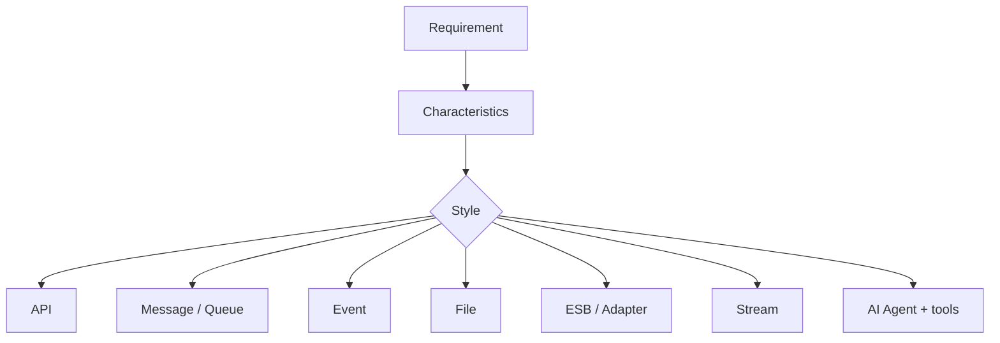

# Lesson 1.3 — Integration Styles

**Module:** 01 — Enterprise Integration Fundamentals  
**Duration:** 25–35 minutes  
**BayLearn philosophy:** WHY → WHEN → HOW. Pattern first. Technology second.

---

## Learning outcomes

By the end of this lesson you will be able to:

1. Describe API, messaging, events, files, ESB, streaming, and agentic integration as styles—not products.
2. Map each style to coupling, latency, cardinality, and payload size.
3. Choose a style from characteristics rather than from a preferred vendor.

---

## Enterprise scenario

CareMesh Health’s PMO lists seven “integrations” on one slide: a patient lookup, lab result distribution, nightly claims files, an HL7 feed from a hospital, a pub/sub of appointment changes, a Kafka-like clickstream, and a proposed chatbot that “talks to the EHR.” They are seven different styles. Treating them as one “interface project” will produce the wrong platform.

> **Fiction notice:** Named companies in this course (Northbridge Bank, Harbor Retail, CareMesh Health, Atlas Manufacturing) are instructional fictions.

---

## WHY this exists

Styles encode **coupling and time**. An API couples caller and provider in time (both must be up) but gives an immediate answer. A queue decouples time and absorbs bursts. An event decouples knowledge of consumers. A file decouples protocol and batch size. An ESB centralizes mediation when you cannot change endpoints. Streaming is a continuous ordered (or partitioned) fact feed—closer to events at high volume. An AI agent is not a transport; it is a reasoning consumer of **governed tools** that still use the other styles.

---

## WHEN an Enterprise Architect uses it

- API: the consumer knows the provider, needs a response now, payload is modest (GET /patients/{id}).
- Message/queue: one worker should process a command; work must survive consumer outages.
- Event: a fact occurred; many independent reactions are valid (LabResultReady).
- File: bulk or partner protocol constraint (nightly 2 GB claims).
- ESB/adapter: protocol mediation you cannot yet remove.
- Streaming: high-volume continuous facts with consumer lag semantics.
- Agent: a human needs a natural-language operational interface over existing tools.

### When NOT to use it

- Do not use an API as a bulk file pipe.
- Do not use a queue when you mean “notify whoever cares” (that is an event/topic).
- Do not use an agent as a bypass around authorization.
- Do not use an ESB as the default for greenfield service-to-service calls.

---

## HOW — the pattern (vendor-neutral)

Put the styles on one decision table used for the rest of the course:

| Style | Time coupling | Consumer knowledge | Typical payload | Cardinality |
|-------|---------------|--------------------|-----------------|-------------|
| API | Coupled | Known provider | Small | 1:1 request/reply |
| Queue | Decoupled | Known worker type | Small–medium | Competing consumers |
| Event | Decoupled | Unknown | Small | 1:N |
| File | Decoupled | Known landing zone | Large | Batch |
| ESB | Mixed | Hub knows both | Mixed | Many:many via hub |
| Stream | Decoupled | Unknown / lagging | Small, high rate | 1:N |
| Agent | Mixed | Tools known, users not | Prompts + tool IO | Orchestrated |

### Architecture diagram

---

## HOW — AWS implementation (after the pattern)

Illustrative mapping only: API Gateway + Lambda; SQS; EventBridge/SNS; S3 + Transfer Family; adapters or Step Functions for orchestration; Kinesis/MSK for streams; Bedrock agents or custom tool-calling loops for agents. The mapping is a **consequence** of the style, not the definition of the style.

Do not start here. If you cannot explain the requirement and pattern without naming an AWS service, you are not ready to select technology.

---

## Anti-patterns

- “We are event-driven” while every consumer is a synchronous HTTP call in disguise.
- Streaming platform as a default because it is fashionable.
- One “integration microservice” that implements all seven styles poorly.

---

## Tradeoffs

| Dimension | Benefit | Cost / risk |
|-----------|---------|-------------|
| API | Immediate consistency for the caller | Availability and latency coupling |
| Events | Independent evolution of consumers | Eventual consistency and replay design |
| Files | Partner reach and bulk efficiency | Latency and operational file hygiene |

---

## Architecture decision prompt

Classify CareMesh’s seven items. Which two are most dangerous to implement as synchronous APIs, and why?

Write four sentences: the requirement, the integration characteristics, the pattern, and why the rejected options fail the NFRs.

---

## Knowledge check

**Q1.** Is an AI agent an integration style for moving a 10 GB file?

*Answer.* No. The agent may *ask* for file status through a tool. The file still moves via a file style (SFTP/S3).

**Q2.** What is the cardinality difference between a queue and an event?

*Answer.* A queue is competing consumers for a command (usually processed once). An event is fan-out: many consumers may each react.

---

## Architect's note

Memorize the decision table. You will reuse it in every lab and every capstone.

---

## Next

Complete any architecture challenge attached to this lesson in the course player. Record an ADR fragment if the decision would survive a design review.
