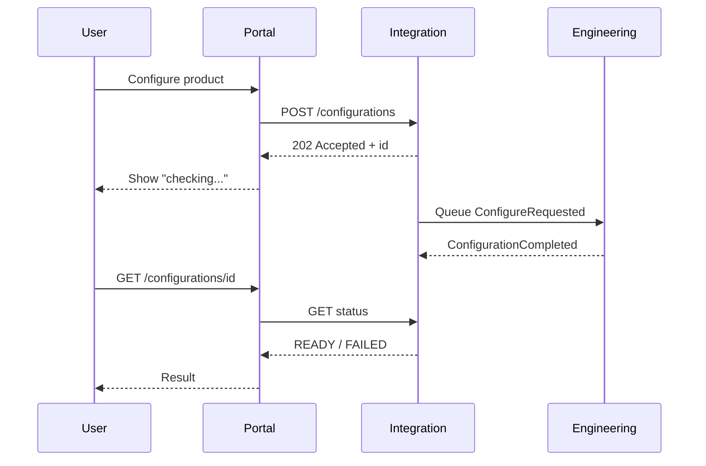

# Lesson 1.4 — Synchronous vs Asynchronous Integration

**Module:** 01 — Enterprise Integration Fundamentals  
**Duration:** 25–35 minutes  
**BayLearn philosophy:** WHY → WHEN → HOW. Pattern first. Technology second.

---

## Learning outcomes

By the end of this lesson you will be able to:

1. Draw sequence diagrams for request/reply versus fire-and-forget versus async status.
2. Explain how timeouts, user experience, and compensating actions differ.
3. Choose sync, async, or sync-over-async (accepted + status) from latency SLAs.

---

## Enterprise scenario

Atlas Manufacturing’s sales portal must show whether a configured product can be built. Engineering’s configurator sometimes takes 40 seconds. Sales wants a spinner. Plant systems want no blocking calls during shift changes. You must decide what “the user waits” actually means.

> **Fiction notice:** Named companies in this course (Northbridge Bank, Harbor Retail, CareMesh Health, Atlas Manufacturing) are instructional fictions.

---

## WHY this exists

Synchronous integration is a **distributed function call**: the caller’s thread, UX, or SLA is held hostage by the provider. Asynchronous integration returns an acknowledgement of *receipt* (or nothing) and completes work later. Most enterprise pain is using sync where the provider cannot meet the caller’s timeout, or using async where the business process legally cannot proceed without an answer (authorization of a payment).

A third pattern—**synchronous acceptance, asynchronous completion**—issues an ID and a status resource. Large files and long workflows almost always need this.

---

## WHEN an Enterprise Architect uses it

- Synchronous: user-facing reads with tight latency (account balance in 300 ms), or a command that must succeed or fail before the next legal step.
- Asynchronous: work that may exceed UX timeouts, bursty load, or providers with weaker SLAs.
- Accepted+status: multi-step or large payload processing the user can poll or subscribe to.

### When NOT to use it

- Do not make a UI wait on a partner SFTP round trip.
- Do not make payment authorization fire-and-forget without a defined completion event and reconciliation.
- Do not hide a 30-second chain of sync calls behind one API and call it “real time.”

---

## HOW — the pattern (vendor-neutral)

Draw time on the vertical axis. If any hop can exceed the caller’s timeout, the design is already wrong. Budgets compose: a 300 ms API with three 150 ms dependencies cannot work. Async designs need a **correlation ID**, an **idempotency key**, and a **completion signal** (event, status row, or callback). Without those, async becomes “we lost the work.”

### Architecture diagram

---

## HOW — AWS implementation (after the pattern)

API Gateway has integration timeouts (and payload limits). Lambda has duration limits. SQS and Step Functions exist specifically so the HTTP request does not wait for the whole business process. Status APIs typically read DynamoDB. None of that excuses a 40-second synchronous configurator behind a 29-second gateway timeout.

Do not start here. If you cannot explain the requirement and pattern without naming an AWS service, you are not ready to select technology.

---

## Anti-patterns

- Raising every timeout to 15 minutes instead of changing style.
- Async with no status—users refresh and raise tickets.
- Callback URLs to unauthenticated internet endpoints.

---

## Tradeoffs

| Dimension | Benefit | Cost / risk |
|-----------|---------|-------------|
| Sync | Simple UX and easier transactional mental model | Timeouts and cascading failure |
| Async | Resilience and elasticity | Status UX, eventual consistency, harder debugging |
| 202 + poll/push | Honest about duration | More moving parts (store, events, UI) |

---

## Architecture decision prompt

If the configurator p95 is 40 s and the portal SLA is 2 s to first response, which sequence diagram is acceptable? What does the customer see if engineering is down for an hour?

Write four sentences: the requirement, the integration characteristics, the pattern, and why the rejected options fail the NFRs.

---

## Knowledge check

**Q1.** Why do timeouts compose badly in synchronous chains?

*Answer.* Each hop consumes part of the caller’s budget. Tail latency adds. A chain that “usually works” fails at p99 and takes the user experience with it.

**Q2.** What three elements must an async process include?

*Answer.* Correlation identifier, idempotent processing, and a completion/failure signal the caller can observe.

---

## Architect's note

If you cannot draw the sequence diagram including failure, you do not understand the integration yet.

---

## Next

Complete any architecture challenge attached to this lesson in the course player. Record an ADR fragment if the decision would survive a design review.
