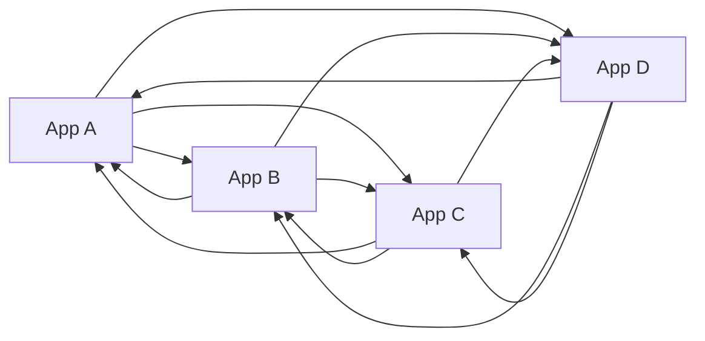

# Lesson 1.5 — Point-to-Point Integration

**Module:** 01 — Enterprise Integration Fundamentals  
**Duration:** 25–35 minutes  
**BayLearn philosophy:** WHY → WHEN → HOW. Pattern first. Technology second.

---

## Learning outcomes

By the end of this lesson you will be able to:

1. Explain why N systems can produce N(N-1) integrations.
2. Recognize when point-to-point is the correct simple choice.
3. Describe the maintenance failure mode of an undocumented mesh.

---

## Enterprise scenario

Northbridge started with core banking calling fraud. Then CRM called core. Then mobile called CRM and core. Then the data team copied from all three. Then a new collections SaaS called CRM and core. Nobody can answer “what happens if we change the customer address schema?” without a two-week discovery. That is point-to-point decay.

> **Fiction notice:** Named companies in this course (Northbridge Bank, Harbor Retail, CareMesh Health, Atlas Manufacturing) are instructional fictions.

---

## WHY this exists

Point-to-point is the default of delivery teams: the shortest path from this project to that API. Each link is locally rational. The estate becomes a complete graph. Every schema change, credential rotation, and outage multiplies. Observability fragments because there is no common correlation. Security reviews cannot enumerate the blast radius.

Hub-and-spoke, event notification, and API products exist to **reduce the number of unique contracts**, not because hubs are fashionable. But a hub that simply tunnels every point-to-point mapping is the same mesh with extra latency—the ESB anti-pattern you will study in Module 8.

---

## WHEN an Enterprise Architect uses it

- Two systems, stable contract, low change rate, same owner—point-to-point can be correct and cheaper.
- A temporary strangler link during migration, with an expiry date in the ADR.

### When NOT to use it

- Many consumers of the same fact (use events).
- Many partners with similar files (use a file platform and templates).
- Every new product requires a new custom link to the same six systems.

---

## HOW — the pattern (vendor-neutral)

Count unique contracts, not boxes. If the same business event is mapped six times, you have a notification problem. If six partners each have a unique private protocol, you have a partner-adapter problem—not a requirement for 36 unique APIs. Publish a contract (API product, event schema, file spec) and make consumers come to it. Record exceptions as ADRs with owners and expiry.

### Architecture diagram

---

## HOW — AWS implementation (after the pattern)

It is just as easy to build a point-to-point mesh on AWS as on premises: Lambda A calls Lambda B calls a private ALB calls a partner URL. EventBridge, SNS, and API products are tools to *reduce* unique links. They do not automatically prevent a mesh if every team still creates a custom event and a custom queue for each pair of applications.

Do not start here. If you cannot explain the requirement and pattern without naming an AWS service, you are not ready to select technology.

---

## Anti-patterns

- Undocumented integrations discovered only in packet captures.
- Shared databases as “integration” between apps.
- Permanent “temporary” interfaces.

---

## Tradeoffs

| Dimension | Benefit | Cost / risk |
|-----------|---------|-------------|
| P2P speed | Fast for the first two systems | Quadratic operational cost |
| Platform | Reusable contracts and shared ops | Requires governance so it does not become a new mesh |

---

## Architecture decision prompt

You have 80 internal applications. If each needs a custom pair-wise integration with 10 others, how many contracts exist? What inventory question would you ask before approving the 801st?

Write four sentences: the requirement, the integration characteristics, the pattern, and why the rejected options fail the NFRs.

---

## Knowledge check

**Q1.** When is point-to-point acceptable?

*Answer.* Stable, low-N, same-owner links with a documented contract—or time-boxed migration links with an expiry.

**Q2.** How does an ESB recreate point-to-point?

*Answer.* If every pair still has a unique mapping owned by the bus team, you have moved the mesh into the hub. Change still requires hub releases.

---

## Architect's note

Your first operating metric for an integration platform is *unique contracts per business event*, not number of Lambdas.

---

## Next

Complete any architecture challenge attached to this lesson in the course player. Record an ADR fragment if the decision would survive a design review.
