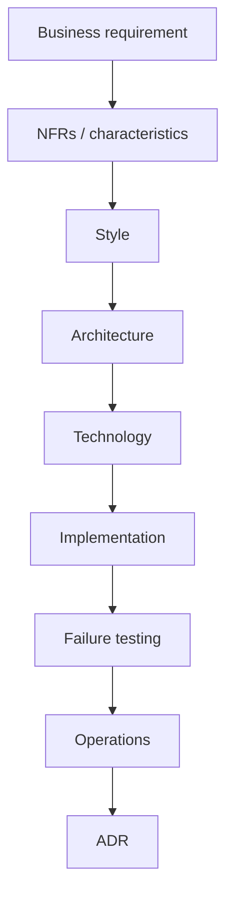

# Lesson 1.6 — Integration Architecture Decision Framework

**Module:** 01 — Enterprise Integration Fundamentals  
**Duration:** 25–35 minutes  
**BayLearn philosophy:** WHY → WHEN → HOW. Pattern first. Technology second.

---

## Learning outcomes

By the end of this lesson you will be able to:

1. Apply API vs Message vs Event vs File vs ESB vs Agent as a repeatable decision procedure.
2. List the NFRs that drive the choice (volume, payload, latency, reliability, ordering, security, cost, coupling).
3. Produce a one-page ADR fragment from a business requirement.

---

## Enterprise scenario

A product owner says: “When a customer updates their address, twenty systems need to know, and the call center needs the new address immediately, and once a night we send a full extract to a regulator, and agents should be able to ask whether the update succeeded.” That is four requirements. The framework exists so you do not pick EventBridge for all of them because the last project used EventBridge.

> **Fiction notice:** Named companies in this course (Northbridge Bank, Harbor Retail, CareMesh Health, Atlas Manufacturing) are instructional fictions.

---

## WHY this exists

Without a framework, teams copy the last success. The last success had different NFRs. The framework forces you to name **characteristics** before **technology**. It is the spine of this course: you will use it in Lab 1, every architecture challenge, Module 14, and all four capstones.

---

## WHEN an Enterprise Architect uses it

- Any new integration request, including “small” ones.
- Any modernization of an ESB mapping.
- Any proposal to let an AI agent take action.

### When NOT to use it

- Do not skip the framework because the team already “knows it is SQS.”
- Do not use the framework to delay a two-system, same-owner, obvious API for a week of ceremony.

---

## HOW — the pattern (vendor-neutral)

Procedure:

1. Write the business action in one sentence.
2. Score: latency, payload size, volume, ordering, delivery guarantee, number of consumers, protocol constraints, sensitivity, cost sensitivity, operational skill.
3. Choose style from the Module 1.3 table.
4. Choose architecture (sync, queue, topic, landing zone, adapter, tool+HITL).
5. Choose technology.
6. Write the ADR: options, decision, security, reliability, cost, operations.

Worked micro-examples: GET balance → API. Process payment instruction that can retry → message. AddressChanged to twenty systems → event. 20 GB nightly to 50 partners → file. ISO20022 over MQ to a host you cannot change this year → adapter. “Did the file arrive?” → agent over a status API, not over the database.

### Architecture diagram

---

## HOW — AWS implementation (after the pattern)

Technology selection is last: API Gateway, SQS, EventBridge/SNS, S3/Transfer Family, an adapter (often still a container or a commercial iPaaS connector), Bedrock or a tool-calling loop. Cost and operational complexity are first-class NFRs—Transfer Family hourly cost, Lambda concurrency, EventBridge bus strategy, and CloudWatch ingestion all belong in the ADR, not as afterthoughts.

Do not start here. If you cannot explain the requirement and pattern without naming an AWS service, you are not ready to select technology.

---

## Anti-patterns

- Starting the design with a service name (“we will use EventBridge”).
- One style applied to an entire domain regardless of NFRs.
- ADRs written after implementation to rubber-stamp the code.

---

## Tradeoffs

| Dimension | Benefit | Cost / risk |
|-----------|---------|-------------|
| Framework discipline | Comparable decisions across teams | Feels bureaucratic if over-applied to trivial links |
| Recording ADRs | Future you can defend the choice | Requires a repository people actually read |

---

## Architecture decision prompt

Split the product owner’s sentence into four flows. Select a style for each. Which flow is most likely to be mis-implemented as a synchronous API, and what incident would that cause?

Write four sentences: the requirement, the integration characteristics, the pattern, and why the rejected options fail the NFRs.

---

## Knowledge check

**Q1.** What comes before technology selection?

*Answer.* Requirement, characteristics/NFRs, style, and architecture.

**Q2.** Why might an agent still use an API?

*Answer.* Agents should call governed tools. Those tools are ordinary integrations (API, queue, file status). The agent is not a new transport into the database.

---

## Architect's note

Lab 1 is this lesson made interactive. If you guess without characteristics, you will fail the lab even if you guess the popular AWS service.

---

## Next

Complete any architecture challenge attached to this lesson in the course player. Record an ADR fragment if the decision would survive a design review.
