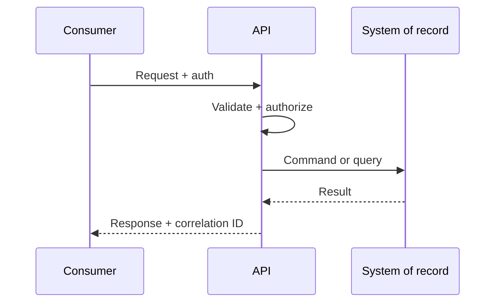

# Lesson 2.1 — API Fundamentals

**Module:** 02 — API-Based Integration  
**Duration:** 25–35 minutes  
**BayLearn philosophy:** WHY → WHEN → HOW. Pattern first. Technology second.

---

## Learning outcomes

By the end of this lesson you will be able to:

1. Define an API as a productized contract, not a URL.
2. Distinguish public, partner, and private APIs.
3. Explain why APIs are the wrong default for bulk and fan-out.

---

## Enterprise scenario

Northbridge’s mobile team “just needs an API to payments.” Payments already has a 15-year ISO message interface. The architect’s job is to decide whether a sync API is the right *product* for this consumer, or a façade over async settlement.

> **Fiction notice:** Named companies in this course (Northbridge Bank, Harbor Retail, CareMesh Health, Atlas Manufacturing) are instructional fictions.

---

## WHY this exists

APIs exist so consumers can invoke a known provider with request/reply semantics. They are the right tool when the caller needs an answer in-band: balances, quotes, create-order with validation errors. They are also how you productize a capability for many consuming teams without giving them database credentials. An API is a **contract plus an SLA**, not a Lambda with API Gateway in front of a table.

---

## WHEN an Enterprise Architect uses it

- Immediate response is required and payload is modest.
- The consumer knows (or is allowed to know) the provider.
- You need input validation and typed errors back to a human or app.
- You are exposing a stable capability as a product.

### When NOT to use it

- The payload is hundreds of megabytes.
- Many unknown consumers should react to a fact (use events).
- The provider cannot meet the caller’s timeout (use async acceptance).

### Integration characteristics to inspect

- Latency SLO
- Payload size
- Authn audience (employee vs customer vs partner)
- Write vs read

---

## HOW — the pattern (vendor-neutral)

Treat APIs as products: owner, version policy, SLOs, authn/z, error model, deprecation. Classify **query APIs** (safe, cacheable reads) versus **command APIs** (state change, need idempotency). Record who is allowed to call, from which network, and what happens when the API is down.

### Architecture diagram

---

## HOW — AWS implementation (after the pattern)

Amazon API Gateway (HTTP or REST), Lambda or containers, IAM/JWT authorizers, WAF, and CloudWatch. Private APIs and VPC links exist for in-estate callers. The presence of API Gateway does not make an integration synchronous-safe if the backend is a 40-second batch job.

Do not start here. If you cannot explain the requirement and pattern without naming an AWS service, you are not ready to select technology.

---

## Anti-patterns

- Database-as-API (exposing tables).
- Chatty APIs that require 20 round trips for one screen.

---

## Tradeoffs

| Dimension | Benefit | Cost / risk |
|-----------|---------|-------------|
| Productized API | Reusable, governed access | Versioning and support load |
| Bespoke API per app | Fits one client perfectly | Becomes point-to-point |

---

## Architecture decision prompt

Should the mobile app call payments synchronously to *initiate* a transfer, to *read status*, or both? What is the user-visible failure if payments is in a maintenance window?

Write four sentences: the requirement, the integration characteristics, the pattern, and why the rejected options fail the NFRs.

---

## Knowledge check

**Q1.** What makes an API a product?

*Answer.* Named owner, contract, SLO, security model, versioning, and support—not merely a deployed URL.

---

## Architect's note

If you cannot name the SLO, you do not have an API product yet.

---

## Next

Complete any architecture challenge attached to this lesson in the course player. Record an ADR fragment if the decision would survive a design review.
