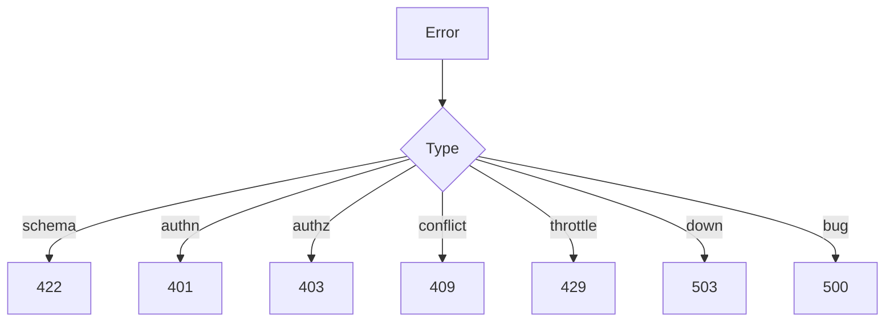

# Lesson 2.10 — API Error Handling

**Module:** 02 — API-Based Integration  
**Duration:** 25–35 minutes  
**BayLearn philosophy:** WHY → WHEN → HOW. Pattern first. Technology second.

---

## Learning outcomes

By the end of this lesson you will be able to:

1. Return a stable error envelope with correlation ID and a machine-readable code.
2. Map validation, auth, conflict, and dependency failures to the right HTTP statuses.
3. Avoid leaking internals while remaining operable.

---

## Enterprise scenario

Mobile showed “Internal Server Error” for both “account frozen” and “DynamoDB throughput.” Agents could not help. Ops could not find the request. Error handling is an UX, ops, and security design.

> **Fiction notice:** Named companies in this course (Northbridge Bank, Harbor Retail, CareMesh Health, Atlas Manufacturing) are instructional fictions.

---

## WHY this exists

Errors are part of the contract. Clients need a code they can branch on, a human message that is safe to show, and a correlation ID for support. Operators need logs with the same ID. Security needs no stack traces or SQL on the wire. Retryable (503, 429) versus not (400, 401, 403, 404, 409, 422) must be explicit or clients will retry the unretryable.

---

## WHEN an Enterprise Architect uses it

- Every external API.
- Internal APIs too—your other teams are clients.

### When NOT to use it

- Do not invent a new JSON error shape per microservice.
- Do not map every problem to 500.
- Do not return 200 with a failure payload unless you are trapped in a legacy SOAP-style constraint (and then document it as a defect).

---

## HOW — the pattern (vendor-neutral)

Standardize: { code, message, details[], correlationId, retryable }. Use 401/403 correctly (unauthenticated vs unauthorized). Use 409 for conflicts (duplicate idempotency replay with different body). Use 422 for schema/business validation if you standardize on it. Include no secrets in details.

### Architecture diagram

---

## HOW — AWS implementation (after the pattern)

API Gateway can return custom responses. Lambda should still emit structured logs. X-Ray/CloudWatch traces must share the correlation ID. Lab 2 requires this envelope.

Do not start here. If you cannot explain the requirement and pattern without naming an AWS service, you are not ready to select technology.

---

## Anti-patterns

- Different error JSON in each resource.
- Stack traces in partner responses.

---

## Tradeoffs

| Dimension | Benefit | Cost / risk |
|-----------|---------|-------------|
| Rich errors | Better UX and ops | Risk of leaking internals if undisciplined |
| Opaque 500s | Safer leakage | Unsupportable products |

---

## Architecture decision prompt

A downstream payment network times out. What status and retryable flag do you return to mobile, and what do you log internally?

Write four sentences: the requirement, the integration characteristics, the pattern, and why the rejected options fail the NFRs.

---

## Knowledge check

**Q1.** Why include correlationId in the error body?

*Answer.* So support and the user/agent can find the exact logs and traces without asking for timestamps and IPs.

---

## Architect's note

Your error model is as important as your success schema. Put it in OpenAPI.

---

## Next

Complete any architecture challenge attached to this lesson in the course player. Record an ADR fragment if the decision would survive a design review.
