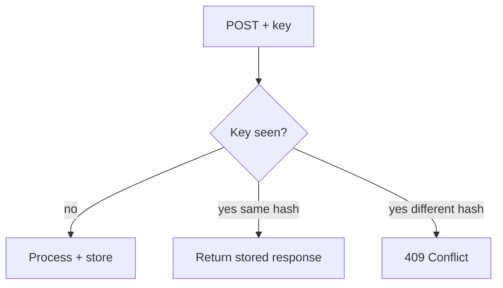

# Lesson 2.11 — API Idempotency

**Module:** 02 — API-Based Integration  
**Duration:** 25–35 minutes  
**BayLearn philosophy:** WHY → WHEN → HOW. Pattern first. Technology second.

---

## Learning outcomes

By the end of this lesson you will be able to:

1. Require idempotency keys for unsafe POSTs that can be retried.
2. Define store semantics: same key + same body = replay response; same key + different body = conflict.
3. Relate HTTP retries, mobile timeouts, and at-least-once messaging to the same idea.

---

## Enterprise scenario

Lab 2 will create orders. Mobile will retry. If you skip this lesson, you will double-charge in the capstone.

> **Fiction notice:** Named companies in this course (Northbridge Bank, Harbor Retail, CareMesh Health, Atlas Manufacturing) are instructional fictions.

---

## WHY this exists

Networks fail after commit but before the client sees 201. At-least-once delivery is the reality of HTTP retries. Idempotency means processing the same logical request once, returning the original result thereafter. It is not optional for payments, orders, or filings. Keys must be unique per client intent, not reused for a different cart.

---

## WHEN an Enterprise Architect uses it

- Any POST that creates a business transaction.
- Any client on mobile or flaky networks.
- Any API that might later be called from a queue worker too.

### When NOT to use it

- Do not key only on customer ID (too coarse).
- Do not expire keys so fast that a 10-minute retry becomes a duplicate.
- GET is already idempotent—do not invent keys for reads.

---

## HOW — the pattern (vendor-neutral)

Client sends Idempotency-Key (UUID or ULID). Server stores key → request hash → response. On repeat: if hash matches, return stored response; if not, 409. Persist long enough to cover client retry windows (hours to days in banking). Combine with natural keys (orderId) when the client can assign IDs.

### Architecture diagram

---

## HOW — AWS implementation (after the pattern)

DynamoDB is a common key store (condition expressions). The Lambda in Lab 2 should honor the header. This is the same discipline as idempotent consumers in Module 3—learn it once, apply it everywhere.

Do not start here. If you cannot explain the requirement and pattern without naming an AWS service, you are not ready to select technology.

---

## Anti-patterns

- Keys logged as if they were secrets when they are not, while skipping actual secrets hygiene.
- In-memory maps on Lambda (lost on cold start—use durable store).

---

## Tradeoffs

| Dimension | Benefit | Cost / risk |
|-----------|---------|-------------|
| Keyed POST | Safe retries | Storage and TTL design |
| Client-assigned IDs only | Simple PUT | Harder for naive mobile clients |

---

## Architecture decision prompt

A client retries POST with the same key but a changed amount. What must the API do, and why is returning 201 with the new amount worse?

Write four sentences: the requirement, the integration characteristics, the pattern, and why the rejected options fail the NFRs.

---

## Knowledge check

**Q1.** Does an idempotency key replace authorization?

*Answer.* No. It only prevents duplicate processing of the same intent by the same authorized principal.

---

## Architect's note

If money can move twice, the architecture is wrong no matter how clean the Terraform is.

---

## Next

Complete any architecture challenge attached to this lesson in the course player. Record an ADR fragment if the decision would survive a design review.
