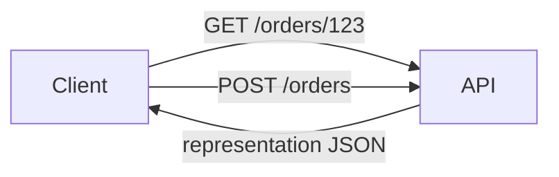

# Lesson 2.2 — REST Architecture

**Module:** 02 — API-Based Integration  
**Duration:** 25–35 minutes  
**BayLearn philosophy:** WHY → WHEN → HOW. Pattern first. Technology second.

---

## Learning outcomes

By the end of this lesson you will be able to:

1. Apply resource-oriented design (nouns, not verbs-in-URLs as the only model).
2. Use uniform interface ideas: identification, representations, self-describing messages.
3. Recognize when RPC-over-HTTP is honest and when it is a REST costume.

---

## Enterprise scenario

Harbor Retail’s first order API was POST /doCreateOrder with a 40-field blob. Mobile, warehouse, and finance each parsed it differently. REST is not aesthetics; it is a way to make resources evolvable and cacheable.

> **Fiction notice:** Named companies in this course (Northbridge Bank, Harbor Retail, CareMesh Health, Atlas Manufacturing) are instructional fictions.

---

## WHY this exists

REST (Representational State Transfer) is an architectural style for networked applications. Resources are identified by URIs. Clients manipulate representations (usually JSON). Uniform methods reduce the need for custom verbs. Hypermedia is optional in most enterprises; **stable resource models and status codes** are not. RPC-over-HTTP can be fine for internal actions (“POST /transfers/{id}/reverse”) if you do not pretend it is REST and then expect caching.

---

## WHEN an Enterprise Architect uses it

- CRUD-ish domain objects that many clients share.
- Need for cacheable reads (GET) and explicit unsafe writes.
- Public or partner APIs where predictability matters.

### When NOT to use it

- Extremely chatty orchestration better modeled as a process API or async workflow.
- Binary bulk transfer.
- When the only “resource” is a stored procedure with 90 parameters—fix the model first.

---

## HOW — the pattern (vendor-neutral)

Identify resources (Order, Payment, CustomerAddress). Separate collection and item URLs. Use representations that match consumer jobs, not internal tables. Keep commands that are not CRUD as documented RPC-style resources rather than twisting nouns until they lie.

### Architecture diagram

---

## HOW — AWS implementation (after the pattern)

API Gateway maps HTTP methods to integrations. You still design the resource model. OpenAPI is the contract artifact. CloudFront caching is only valid for true GETs with correct cache keys and authorization.

Do not start here. If you cannot explain the requirement and pattern without naming an AWS service, you are not ready to select technology.

---

## Anti-patterns

- GET that places orders.
- Verbs in paths for every action without a resource model.

---

## Tradeoffs

| Dimension | Benefit | Cost / risk |
|-----------|---------|-------------|
| REST resources | Evolvable, cacheable reads | Awkward for long-running processes |
| RPC/HTTP | Fits actions | Weaker caching and easier to explode into unique verbs |

---

## Architecture decision prompt

Is “ReserveInventory” a resource state change on an Order, a new InventoryReservation resource, or a message? What breaks if two clients use different models?

Write four sentences: the requirement, the integration characteristics, the pattern, and why the rejected options fail the NFRs.

---

## Knowledge check

**Q1.** Why is GET special?

*Answer.* It is safe and idempotent in HTTP semantics, enabling caching, retries, and simpler reasoning—if you do not hide writes in GET.

---

## Architect's note

REST is a style. If you violate HTTP safety, say so in the contract.

---

## Next

Complete any architecture challenge attached to this lesson in the course player. Record an ADR fragment if the decision would survive a design review.
