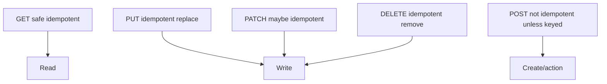

# Lesson 2.3 — HTTP Methods

**Module:** 02 — API-Based Integration  
**Duration:** 25–35 minutes  
**BayLearn philosophy:** WHY → WHEN → HOW. Pattern first. Technology second.

---

## Learning outcomes

By the end of this lesson you will be able to:

1. Choose GET, POST, PUT, PATCH, DELETE with correct safety and idempotency expectations.
2. Explain why POST is not always non-idempotent in practice (and why you still need keys).
3. Map methods to order-create and order-read in Lab 2.

---

## Enterprise scenario

A partner retries POST /orders because of a mobile timeout. Without an Idempotency-Key, Harbor creates two orders and two payment attempts. Method choice and idempotency are inseparable.

> **Fiction notice:** Named companies in this course (Northbridge Bank, Harbor Retail, CareMesh Health, Atlas Manufacturing) are instructional fictions.

---

## WHY this exists

GET retrieves a representation and must not change server state. POST creates or triggers processing; it is not idempotent by HTTP definition. PUT replaces a resource at a known ID and should be idempotent. PATCH applies a partial update; idempotency depends on the patch semantics. DELETE removes or tombstones; repeating DELETE should not create a new error after the resource is gone (typically 404 or 204). Architects choose methods to make **retries safe**.

---

## WHEN an Enterprise Architect uses it

- GET for reads, including status resources.
- POST for creation when the server assigns IDs.
- PUT when the client knows the ID and replacement is the model.
- PATCH for partial updates with a documented merge model.
- DELETE for removal with defined tombstone behavior.

### When NOT to use it

- Do not use GET for side effects.
- Do not use PUT to “create or append a payment” if replacement would destroy history.
- Do not assume POST retries are safe.

---

## HOW — the pattern (vendor-neutral)

Publish a method table in the API contract. For POST creates, require Idempotency-Key (Lesson 2.11). For PUT, define whether lost updates are prevented with ETags. Align status codes: 201 created, 202 accepted, 204 no content, 409 conflict, 422 validation.

### Architecture diagram

---

## HOW — AWS implementation (after the pattern)

API Gateway + Lambda can implement any method. Gateway does not enforce HTTP safety for you. Lab 2 implements POST /orders and GET /orders/{id}—notice there is no GET that creates.

Do not start here. If you cannot explain the requirement and pattern without naming an AWS service, you are not ready to select technology.

---

## Anti-patterns

- Using 200 for created resources with no Location.
- DELETE that physically erases audit history in a bank.

---

## Tradeoffs

| Dimension | Benefit | Cost / risk |
|-----------|---------|-------------|
| POST + server IDs | Simple clients | Must add idempotency keys |
| PUT + client IDs | Natural retries | ID allocation and ownership rules |

---

## Architecture decision prompt

If POST /orders times out after the server committed, what should the client send on retry, and which method remains GET?

Write four sentences: the requirement, the integration characteristics, the pattern, and why the rejected options fail the NFRs.

---

## Knowledge check

**Q1.** Is PUT always safe to retry?

*Answer.* It should be idempotent as a replacement, but lost-update races still need ETags or version fields.

---

## Architect's note

Lab 2 will punish a GET with side effects. Do not invent one.

---

## Next

Complete any architecture challenge attached to this lesson in the course player. Record an ADR fragment if the decision would survive a design review.
