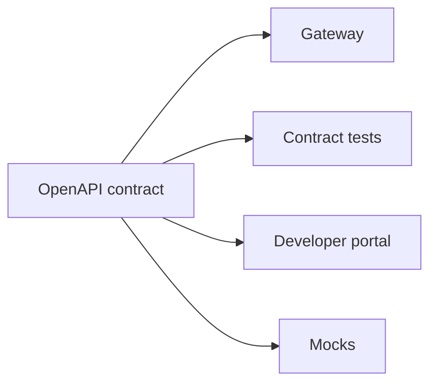

# Lesson 2.4 — API Contracts

**Module:** 02 — API-Based Integration  
**Duration:** 25–35 minutes  
**BayLearn philosophy:** WHY → WHEN → HOW. Pattern first. Technology second.

---

## Learning outcomes

By the end of this lesson you will be able to:

1. Treat OpenAPI as the source of truth for fields, errors, and auth.
2. Explain consumer-driven vs provider-driven contract testing at an architecture level.
3. Decide what is in the public contract versus internal domain model.

---

## Enterprise scenario

CareMesh published a PDF of “the API.” Three vendors implemented three interpretations of optional birthdate. A machine-readable contract would have failed CI before patients were mismatched.

> **Fiction notice:** Named companies in this course (Northbridge Bank, Harbor Retail, CareMesh Health, Atlas Manufacturing) are instructional fictions.

---

## WHY this exists

A contract is the **supported behavior** of the API: resources, schemas, required headers, error envelopes, pagination, rate limits, and lifecycle. Documents in slides are not contracts. Code is not a contract if consumers cannot see it. Breaking a contract is a business event: pagers, version bumps, or both.

---

## WHEN an Enterprise Architect uses it

- Any API with more than one consuming team or a partner.
- When you need generated clients or mock servers.
- When security wants a reviewable surface.

### When NOT to use it

- A one-off script between the same two developers this afternoon—still write a JSON example, just do not pretend it is a platform.

---

## HOW — the pattern (vendor-neutral)

Write OpenAPI (or equivalent) first for public/partner APIs. Keep an anti-corruption layer so internal models can change. Version the contract. Add examples for error paths. Require contract tests in CI: provider verifies it still meets the spec; consumers verify they can parse it.

### Architecture diagram

---

## HOW — AWS implementation (after the pattern)

API Gateway can import OpenAPI. That import is not governance. Store specs in git next to Terraform. Reject deploys that silently drop fields. JSON Schema (next lesson) is often embedded in the contract.

Do not start here. If you cannot explain the requirement and pattern without naming an AWS service, you are not ready to select technology.

---

## Anti-patterns

- Optional fields that are actually required in the implementation.
- Undocumented headers that production depends on.

---

## Tradeoffs

| Dimension | Benefit | Cost / risk |
|-----------|---------|-------------|
| Spec-first | Clear review and mocks | Feels slower on day one |
| Code-first | Fast spike | Consumers reverse-engineer production |

---

## Architecture decision prompt

A field must move from optional to required. Is that a breaking change? What is your communication path to twenty consumers?

Write four sentences: the requirement, the integration characteristics, the pattern, and why the rejected options fail the NFRs.

---

## Knowledge check

**Q1.** What is a breaking change?

*Answer.* Any change that causes a well-behaved consumer of the previous contract to fail or misinterpret data—removed fields, tighter required, changed meaning, auth changes.

---

## Architect's note

If it is not in the contract, it is not supported—even if a Lambda still reads it.

---

## Next

Complete any architecture challenge attached to this lesson in the course player. Record an ADR fragment if the decision would survive a design review.
