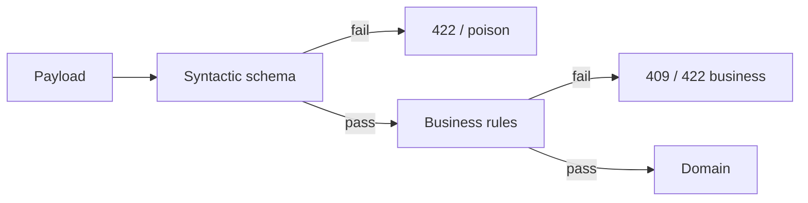

# Lesson 2.5 — JSON Schema

**Module:** 02 — API-Based Integration  
**Duration:** 25–35 minutes  
**BayLearn philosophy:** WHY → WHEN → HOW. Pattern first. Technology second.

---

## Learning outcomes

By the end of this lesson you will be able to:

1. Use JSON Schema (or equivalent) to validate payloads at the edge.
2. Distinguish syntactic validation from business validation.
3. Place validation where poison messages and bad files cannot enter the estate.

---

## Enterprise scenario

A partner sent amount as a string "1,000.00" with a comma. Downstream payment posting treated it as 1. Harbor lost a day to reconciliation. Schema validation at the edge would have returned 422 in milliseconds.

> **Fiction notice:** Named companies in this course (Northbridge Bank, Harbor Retail, CareMesh Health, Atlas Manufacturing) are instructional fictions.

---

## WHY this exists

JSON Schema describes types, required fields, ranges, formats, and enumerations. It catches **malformed** data. It does not catch “this account is frozen” or “this SKU is discontinued.” Architects still need business rules. But most incidents start as malformed messages that were stored, queued, and replayed for hours.

---

## WHEN an Enterprise Architect uses it

- Public and partner APIs.
- Events and file row schemas as well as REST bodies.
- Anywhere you currently parse JSON and hope.

### When NOT to use it

- Do not encode the entire credit policy in JSON Schema.
- Do not reject unknown fields if you promised forward compatibility—configure additionalProperties deliberately.

---

## HOW — the pattern (vendor-neutral)

Validate at the first trust boundary. Return a stable error envelope with a machine-readable code and a correlation ID. Keep schemas versioned with the contract. For files, validate the header and a sample of rows before the whole batch posts.

### Architecture diagram

---

## HOW — AWS implementation (after the pattern)

API Gateway HTTP APIs have limited native JSON Schema; many teams validate in Lambda with a library. That is acceptable if it is the first thing the function does and failures are metric’d. Do not validate only in a deep domain service after the payload has fanned out.

Do not start here. If you cannot explain the requirement and pattern without naming an AWS service, you are not ready to select technology.

---

## Anti-patterns

- Validating only in the UI.
- Different schemas for the same event in each consumer.

---

## Tradeoffs

| Dimension | Benefit | Cost / risk |
|-----------|---------|-------------|
| Strict schema | Fewer poison messages | Harder evolution |
| Loose schema | Easier change | Garbage enters queues and lakes |

---

## Architecture decision prompt

Where should validation live if both API Gateway and a later SQS consumer can receive the same logical order?

Write four sentences: the requirement, the integration characteristics, the pattern, and why the rejected options fail the NFRs.

---

## Knowledge check

**Q1.** Does a valid JSON Schema document mean the payment is legal?

*Answer.* No. It means the document is well-formed. Business eligibility is a separate layer.

---

## Architect's note

Lab 2 requires validation. Fail closed on types; be explicit about additional properties.

---

## Next

Complete any architecture challenge attached to this lesson in the course player. Record an ADR fragment if the decision would survive a design review.
