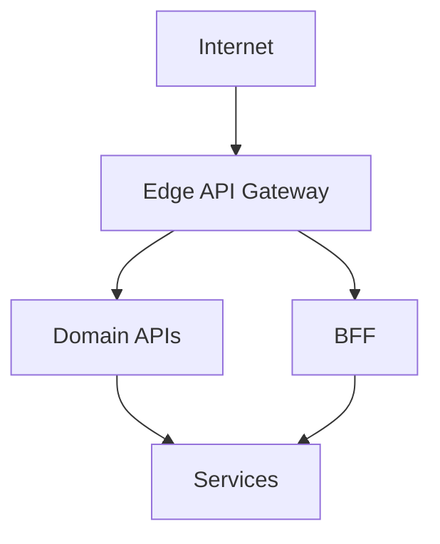

# Lesson 2.8 — API Gateway Patterns

**Module:** 02 — API-Based Integration  
**Duration:** 25–35 minutes  
**BayLearn philosophy:** WHY → WHEN → HOW. Pattern first. Technology second.

---

## Learning outcomes

By the end of this lesson you will be able to:

1. Place a gateway for cross-cutting concerns without turning it into an ESB.
2. Compare edge gateway, private gateway, and backend-for-frontend.
3. Know payload and timeout limits as architectural constraints.

---

## Enterprise scenario

A team put content-based routing, transformation, orchestration, and business rules into API Gateway mappings because it was “free.” It became an untestable ESB. Gateways should terminate HTTP, auth, rate limits, and routing—not own the domain.

> **Fiction notice:** Named companies in this course (Northbridge Bank, Harbor Retail, CareMesh Health, Atlas Manufacturing) are instructional fictions.

---

## WHY this exists

An API gateway is a **reverse proxy with policy**. Good jobs: TLS, authn, throttling, WAF, routing to services, API keys for partners, request IDs. Bad jobs: canonical data model of the enterprise, multi-step sagas, large file ingest. Backend-for-frontend (BFF) gateways adapt for one channel (mobile vs web) without polluting the domain API.

---

## WHEN an Enterprise Architect uses it

- North-south entry from internet or partners.
- East-west only when you need a consistent policy enforcement point.
- BFF when channels need radically different representations.

### When NOT to use it

- Do not push 10 GB through the gateway (Module 7).
- Do not implement the saga in mapping templates.
- Do not require every internal call to hairpin through a public gateway.

---

## HOW — the pattern (vendor-neutral)

Draw the gateway as a policy boundary. Keep domain logic in services. If you need orchestration, use a workflow engine or a service—not the gateway’s Swiss-army transformations. Document timeout and payload limits as first-class NFRs.

### Architecture diagram

---

## HOW — AWS implementation (after the pattern)

Amazon API Gateway REST vs HTTP APIs: features vs cost/simplicity. Integrations: Lambda, HTTP, private. Payload limits (~10 MB) and integration timeouts (~29 s for REST) **force** async patterns for long work. That is an architecture decision, not a ticket to AWS support.

Do not start here. If you cannot explain the requirement and pattern without naming an AWS service, you are not ready to select technology.

---

## Anti-patterns

- VTL/mapping-template business logic.
- Public gateway for high-privilege admin APIs without extra controls.

---

## Tradeoffs

| Dimension | Benefit | Cost / risk |
|-----------|---------|-------------|
| Shared gateway | Central policy | Risk of becoming an ESB |
| Per-domain gateway | Team autonomy | Inconsistent security if ungoverned |

---

## Architecture decision prompt

A client wants to upload a 25 GB media file via POST through API Gateway. Which lesson’s pattern replaces this, and why is the gateway the wrong edge?

Write four sentences: the requirement, the integration characteristics, the pattern, and why the rejected options fail the NFRs.

---

## Knowledge check

**Q1.** Name two hard limits that change API style.

*Answer.* Payload size and integration timeout. Exceeding them requires claim-check / async status, not a bigger gateway.

---

## Architect's note

When the gateway needs unit tests for business rules, you have the wrong design.

---

## Next

Complete any architecture challenge attached to this lesson in the course player. Record an ADR fragment if the decision would survive a design review.
