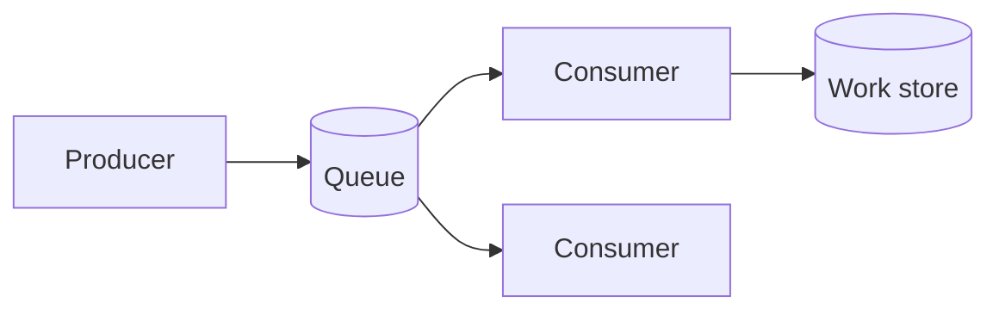

# Lesson 3.1 — Messaging Fundamentals

**Module:** 03 — Enterprise Messaging  
**Duration:** 25–35 minutes  
**BayLearn philosophy:** WHY → WHEN → HOW. Pattern first. Technology second.

---

## Learning outcomes

By the end of this lesson you will be able to:

1. Define a message as a command or document sent to a worker, not a public broadcast.
2. Explain decoupling of time and availability.
3. Contrast messaging with APIs and events.

---

## Enterprise scenario

Northbridge’s fraud check sometimes takes 8 seconds and sometimes 90. The API that opened the account cannot wait. A message says “perform fraud check on application 55” to a worker that may start later.

> **Fiction notice:** Named companies in this course (Northbridge Bank, Harbor Retail, CareMesh Health, Atlas Manufacturing) are instructional fictions.

---

## WHY this exists

Messaging exists to **decouple producers from the availability and speed of consumers** while retaining a delivery intention. Unlike a broadcast event, someone is supposed to do the work. Unlike an API, the producer does not wait for completion (unless a reply queue is designed). Messages survive consumer crashes if the broker does its job.

---

## WHEN an Enterprise Architect uses it

- Work can be asynchronous.
- You need back-pressure and buffering.
- The producer should not fail when the consumer is down (for a bounded time).
- A single logical worker type should process each command.

### When NOT to use it

- The caller must have the answer in 200 ms in-band.
- You need unknown fan-out of facts (events).
- The payload is a 20 GB file (claim check + file style).

---

## HOW — the pattern (vendor-neutral)

Producer writes a message to a queue (point-to-point) with a contract (schema, ID, correlation). Consumers compete. Ack on success; retry on failure; DLQ after policy. Include idempotency because delivery is at-least-once in practice.

### Architecture diagram

---

## HOW — AWS implementation (after the pattern)

Amazon SQS is the canonical AWS queue. SNS is not a queue (it is pub/sub). EventBridge is an event router. Choosing SQS means you chose the **message** style. Lab 3 implements that style.

Do not start here. If you cannot explain the requirement and pattern without naming an AWS service, you are not ready to select technology.

---

## Anti-patterns

- Using a queue as an event broadcast to 15 unrelated teams.
- Unbounded payload in the message body.

---

## Tradeoffs

| Dimension | Benefit | Cost / risk |
|-----------|---------|-------------|
| Queue | Absorb outages and spikes | Operational lag and at-least-once duplicates |
| Sync API | Immediate result | Coupled failure |

---

## Architecture decision prompt

Fraud check vs “CustomerRegistered so marketing may send email”—which is a message and which is an event?

Write four sentences: the requirement, the integration characteristics, the pattern, and why the rejected options fail the NFRs.

---

## Knowledge check

**Q1.** Who is the consumer of a command message?

*Answer.* A competing worker of a known type, not “anyone interested.”

---

## Architect's note

If nobody is on the hook to process it, it is not a command—do not put it in a work queue.

---

## Next

Complete any architecture challenge attached to this lesson in the course player. Record an ADR fragment if the decision would survive a design review.
