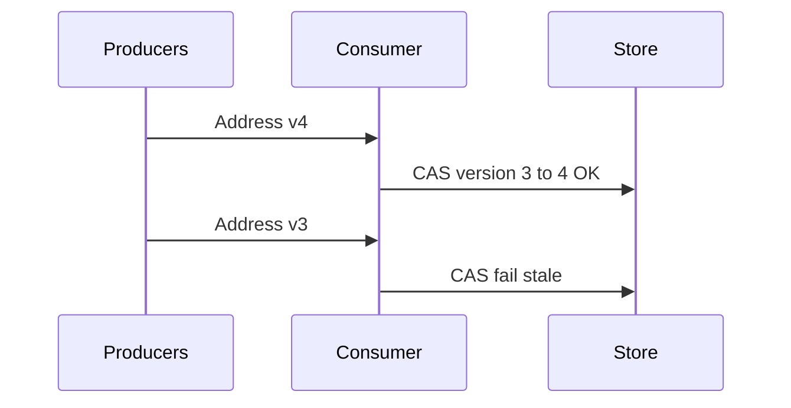

# Lesson 3.10 — Message Ordering

**Module:** 03 — Enterprise Messaging  
**Duration:** 25–35 minutes  
**BayLearn philosophy:** WHY → WHEN → HOW. Pattern first. Technology second.

---

## Learning outcomes

By the end of this lesson you will be able to:

1. Separate “order of arrival” from “order of application.”
2. Use versions, vector-like stamps, or per-key FIFO deliberately.
3. Design for out-of-order as the default on the public internet.

---

## Enterprise scenario

AddressChanged events arrived as v4 then v3 because two regions published. CRM applied v3 last and rolled back the address. Ordering is a business rule, not a network property.

> **Fiction notice:** Named companies in this course (Northbridge Bank, Harbor Retail, CareMesh Health, Atlas Manufacturing) are instructional fictions.

---

## WHY this exists

Distributed systems reorder. Even FIFO only orders within a group on one broker path. Architects put a **monotonic version** on the entity and refuse stale writes (conditional update). For sagas, name the legal sequences. For files, use sequence numbers in names (Module 6). Hoping Kafka/SQS “just orders” is how you corrupt CRMs.

---

## WHEN an Enterprise Architect uses it

- Any entity with concurrent updates.
- Multi-region or multi-producer facts.
- Workflows where step 2 before step 1 is illegal.

### When NOT to use it

- Do not global-sequence the enterprise.
- Do not assume consumer clock time is event time.

---

## HOW — the pattern (vendor-neutral)

Include entity version or occurredAt plus a tie-breaker in the contract. Consumers apply compare-and-set. Buffer only when you must wait for a gap (and have a timeout). Document legal reorderings. Test out-of-order in the chaos lab.

### Architecture diagram

---

## HOW — AWS implementation (after the pattern)

DynamoDB conditional writes on a version attribute. FIFO group IDs. EventBridge does not magically order unrelated events. Kinesis/MSK give partition order—partition key design is the architecture.

Do not start here. If you cannot explain the requirement and pattern without naming an AWS service, you are not ready to select technology.

---

## Anti-patterns

- Sorting by consumer received-at.
- Dropping sequence numbers from file names.

---

## Tradeoffs

| Dimension | Benefit | Cost / risk |
|-----------|---------|-------------|
| CAS versions | Correct last-write-wins with intent | Need a version authority |
| Last arrival wins | Simple | Silent rollback of good data |

---

## Architecture decision prompt

v4 arrives before v3. What should CRM store, and what log line proves it refused the stale event?

Write four sentences: the requirement, the integration characteristics, the pattern, and why the rejected options fail the NFRs.

---

## Knowledge check

**Q1.** Does a timestamp from the producer always define order?

*Answer.* No. Clocks skew. Prefer entity versions issued by the system of record.

---

## Architect's note

Module 5’s eventual consistency is this lesson in event clothing. You already know the move: versions.

---

## Next

Complete any architecture challenge attached to this lesson in the course player. Record an ADR fragment if the decision would survive a design review.
