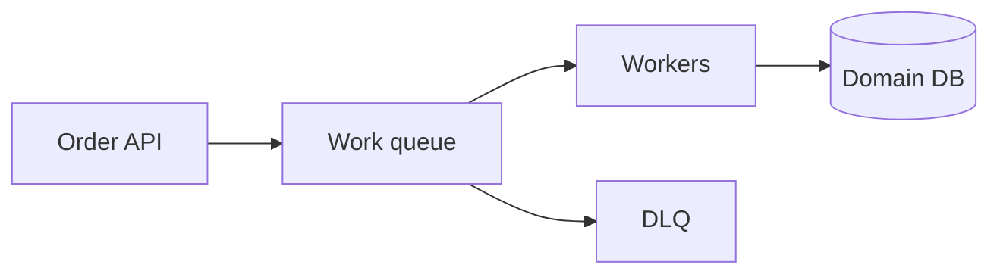

# Lesson 3.2 — Queue Architecture

**Module:** 03 — Enterprise Messaging  
**Duration:** 25–35 minutes  
**BayLearn philosophy:** WHY → WHEN → HOW. Pattern first. Technology second.

---

## Learning outcomes

By the end of this lesson you will be able to:

1. Draw producer, queue, competing consumers, DLQ, and poison handling.
2. Place the queue relative to the system of record.
3. Decide what is stored in the message versus claimed in object storage.

---

## Enterprise scenario

Harbor’s inventory reservation workers scale from 2 to 50 at noon. The queue is the architectural shock absorber between checkout and warehouse capacity.

> **Fiction notice:** Named companies in this course (Northbridge Bank, Harbor Retail, CareMesh Health, Atlas Manufacturing) are instructional fictions.

---

## WHY this exists

A queue is a durable buffer with competing consumers. Architecture concerns: visibility timeout, retention, encryption, access policy, DLQ, and the idempotent store. The queue is not the system of record for the business entity; it is the record of **work to be done**. After success, the business entity lives in the domain database; the message should be deleted.

---

## WHEN an Enterprise Architect uses it

- Spike absorption.
- Protecting a slower downstream.
- Retryable work.

### When NOT to use it

- As a database.
- As a broadcast mechanism.
- As a place to store 256 KB+ of accidental XML plus images.

---

## HOW — the pattern (vendor-neutral)

Keep messages small: identifiers, command type, version, correlation, idempotency key. Use claim-check for blobs. Secure the queue so only the producer role can send and only the consumer role can receive. Monitor depth as an SLO.

### Architecture diagram

---

## HOW — AWS implementation (after the pattern)

SQS standard vs FIFO (later lessons). Encryption with KMS. Resource policies. CloudWatch ApproximateNumberOfMessagesVisible is an operational metric you will put on the Module 13 dashboard.

Do not start here. If you cannot explain the requirement and pattern without naming an AWS service, you are not ready to select technology.

---

## Anti-patterns

- Infinite retention as an archive.
- Consumers that never delete messages.

---

## Tradeoffs

| Dimension | Benefit | Cost / risk |
|-----------|---------|-------------|
| Buffer | Smooths load | Stale work and memory of old bugs in the backlog |
| No buffer | Simple | Downstream outage becomes caller outage |

---

## Architecture decision prompt

If the queue is at 2 million messages, is the architecture wrong, the consumer too small, or the producer in a retry storm?

Write four sentences: the requirement, the integration characteristics, the pattern, and why the rejected options fail the NFRs.

---

## Knowledge check

**Q1.** Should the queue be the system of record for an order?

*Answer.* No. It holds work items. The order’s business state belongs in the domain store.

---

## Architect's note

Queue depth is both a scaling signal and a customer-delay signal. Treat it as business telemetry.

---

## Next

Complete any architecture challenge attached to this lesson in the course player. Record an ADR fragment if the decision would survive a design review.
