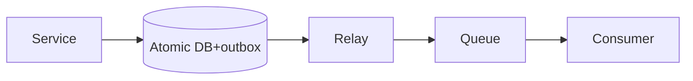

# Lesson 3.3 — Producer/Consumer Pattern

**Module:** 03 — Enterprise Messaging  
**Duration:** 25–35 minutes  
**BayLearn philosophy:** WHY → WHEN → HOW. Pattern first. Technology second.

---

## Learning outcomes

By the end of this lesson you will be able to:

1. Assign responsibilities: producer validates and sends; consumer processes idempotently.
2. Avoid dual-write bugs when the producer also writes a database.
3. Know when to use transactional outbox.

---

## Enterprise scenario

The order service wrote “ORDERED” to DynamoDB and then failed to send SQS. Warehouse never reserved stock. Or it sent SQS and failed to write DynamoDB. Dual write is the classic producer bug.

> **Fiction notice:** Named companies in this course (Northbridge Bank, Harbor Retail, CareMesh Health, Atlas Manufacturing) are instructional fictions.

---

## WHY this exists

Producers are responsible for a valid, authorized command and for not losing it. Consumers are responsible for effect and ack. The dangerous pattern is **two stores** (DB and queue) updated without a transaction. Architects choose: outbox pattern, listen-to-yourself, or a single write (queue only, with the DB as a consumer).

---

## WHEN an Enterprise Architect uses it

- Any reliable command pipeline.
- When the producer is also a system of record.

### When NOT to use it

- Fire-and-forget telemetry where loss is acceptable (still consider events).

---

## HOW — the pattern (vendor-neutral)

Preferred: write domain state and an outbox row atomically; a relay publishes to the queue. Alternative: write the queue first with enough data to reconstruct, then let the consumer be the system of record (not always valid in banking). Document the choice in an ADR.

### Architecture diagram

---

## HOW — AWS implementation (after the pattern)

DynamoDB streams or outbox tables + Lambda relay to SQS. Lab 3 starts simpler (producer Lambda sends to SQS) so you can see failure, then you should discuss the dual-write gap in architecture questions.

Do not start here. If you cannot explain the requirement and pattern without naming an AWS service, you are not ready to select technology.

---

## Anti-patterns

- Producer catching all errors and swallowing them.
- Consumer assuming uniqueness without a key.

---

## Tradeoffs

| Dimension | Benefit | Cost / risk |
|-----------|---------|-------------|
| Outbox | No lost/dup at the producer boundary | More moving parts |
| Best-effort send | Simple lab | Lost or duplicate commands under failure |

---

## Architecture decision prompt

If Lab 3’s producer times out after SQS accepted the message, what must the consumer do when the producer retries?

Write four sentences: the requirement, the integration characteristics, the pattern, and why the rejected options fail the NFRs.

---

## Knowledge check

**Q1.** What is a dual-write?

*Answer.* Updating two uncoordinated stores (for example a database and a queue) and hoping both succeed.

---

## Architect's note

Capstone 2’s saga will fail if you cannot explain producer reliability.

---

## Next

Complete any architecture challenge attached to this lesson in the course player. Record an ADR fragment if the decision would survive a design review.
