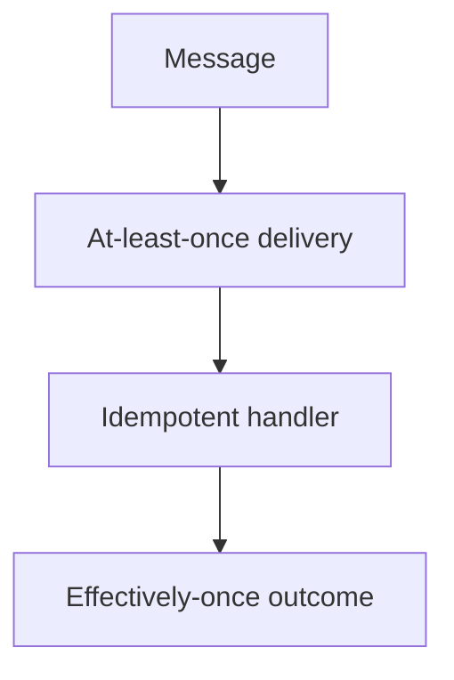

# Lesson 3.4 — Delivery Semantics

**Module:** 03 — Enterprise Messaging  
**Duration:** 25–35 minutes  
**BayLearn philosophy:** WHY → WHEN → HOW. Pattern first. Technology second.

---

## Learning outcomes

By the end of this lesson you will be able to:

1. Define at-most-once, at-least-once, and exactly-once as distributed systems claims.
2. Explain why exactly-once across systems is usually “effectively once” via idempotency.
3. Choose operations that can be made idempotent.

---

## Enterprise scenario

A vendor promised “exactly-once SQS.” Then a consumer timed out after posting a payment but before ack. The message reappeared. Exactly-once delivery of the *message* is not the same as exactly-once *side effect*.

> **Fiction notice:** Named companies in this course (Northbridge Bank, Harbor Retail, CareMesh Health, Atlas Manufacturing) are instructional fictions.

---

## WHY this exists

At-most-once: send and forget; loss is possible. At-least-once: retries until ack; duplicates are possible. Exactly-once delivery in the wild is typically **at-least-once plus idempotent handlers plus dedupe storage**. Brokers may offer FIFO dedupe windows; they do not erase side effects in other systems. Architects design **effectively-once business outcomes**.

---

## WHEN an Enterprise Architect uses it

- At-least-once + idempotency: money, orders, provisioning.
- At-most-once: optional metrics where loss is cheaper than complexity.

### When NOT to use it

- Do not tell executives “the queue guarantees exactly-once payments.”
- Do not skip idempotency because FIFO is enabled.

---

## HOW — the pattern (vendor-neutral)

Make handlers idempotent. Store processed IDs. Use natural transactions where a single store can commit the effect and the processed marker. Design compensating actions when a side effect cannot be made idempotent (rare; prefer to change the API).

### Architecture diagram

---

## HOW — AWS implementation (after the pattern)

SQS standard: at-least-once, occasional duplicates. SQS FIFO: at-least-once with deduplication on a 5-minute producer window—still not a substitute for consumer idempotency if your side effect is outside SQS. Lab 3 will duplicate on purpose.

Do not start here. If you cannot explain the requirement and pattern without naming an AWS service, you are not ready to select technology.

---

## Anti-patterns

- Non-idempotent email + auto-retry forever.
- Using wall-clock “we probably sent it” as dedupe.

---

## Tradeoffs

| Dimension | Benefit | Cost / risk |
|-----------|---------|-------------|
| At-least-once | No silent loss | Must handle duplicates |
| At-most-once | Simple | Silent loss |

---

## Architecture decision prompt

Is “exactly-once” a delivery property, a handler property, or a business invariant? Who owns it in the ADR?

Write four sentences: the requirement, the integration characteristics, the pattern, and why the rejected options fail the NFRs.

---

## Knowledge check

**Q1.** Why is FIFO not enough for payment side effects?

*Answer.* Dedupe windows and delivery guarantees do not include the external ledger. The handler must still be idempotent.

---

## Architect's note

Say “effectively once” in design reviews. It signals you have met production.

---

## Next

Complete any architecture challenge attached to this lesson in the course player. Record an ADR fragment if the decision would survive a design review.
