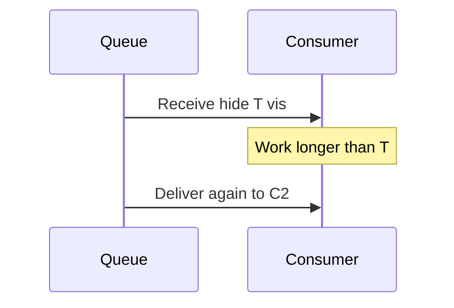

# Lesson 3.5 — Visibility Timeout

**Module:** 03 — Enterprise Messaging  
**Duration:** 25–35 minutes  
**BayLearn philosophy:** WHY → WHEN → HOW. Pattern first. Technology second.

---

## Learning outcomes

By the end of this lesson you will be able to:

1. Set visibility timeout relative to processing time, not to a guess of zero.
2. Explain why too short causes duplicate in-flight work and too long stalls recovery.
3. Use heartbeat/extend when work duration varies.

---

## Enterprise scenario

A Lambda runs 70 seconds. Visibility was 30 seconds. Two Lambdas posted the same shipment. The queue was “working as designed.”

> **Fiction notice:** Named companies in this course (Northbridge Bank, Harbor Retail, CareMesh Health, Atlas Manufacturing) are instructional fictions.

---

## WHY this exists

Visibility timeout is how long a received message is hidden from other consumers. It is not the same as retention. If processing exceeds visibility, another consumer receives the same message—at-least-once becomes concurrent duplicate processing. If visibility is huge and a consumer dies, work stalls until the timeout.

---

## WHEN an Enterprise Architect uses it

- Always, for every queue.
- When p99 processing time is known from metrics.

### When NOT to use it

- Do not set visibility to maximum “just in case” without a dead-consumer story.
- Do not set it below the function timeout.

---

## HOW — the pattern (vendor-neutral)

Rule of thumb: visibility > function timeout + buffer, and extend if using long workers. Prefer smaller units of work. Measure processing time; alert when it approaches visibility. Document in the runbook.

### Architecture diagram

---

## HOW — AWS implementation (after the pattern)

SQS visibility timeout, ChangeMessageVisibility, Lambda event source mapping (it coordinates deletes). Lambda timeout must be less than visibility or you will double-process. Lab 3 asks you to break this on purpose.

Do not start here. If you cannot explain the requirement and pattern without naming an AWS service, you are not ready to select technology.

---

## Anti-patterns

- Visibility = 0.
- Visibility = 12 hours for a 2-second job.

---

## Tradeoffs

| Dimension | Benefit | Cost / risk |
|-----------|---------|-------------|
| Short visibility | Fast redelivery on crash | Duplicate concurrent work |
| Long visibility | Time to finish | Slow recovery after a crash |

---

## Architecture decision prompt

Worker p99 is 12s, timeout is 15s, visibility is 10s. Predict the incident.

Write four sentences: the requirement, the integration characteristics, the pattern, and why the rejected options fail the NFRs.

---

## Knowledge check

**Q1.** Does a visibility timeout ack the message?

*Answer.* No. It only hides it. Delete/ack happens after successful processing.

---

## Architect's note

Chaos lab: shrink visibility and watch duplicates. Then you will never forget it.

---

## Next

Complete any architecture challenge attached to this lesson in the course player. Record an ADR fragment if the decision would survive a design review.
