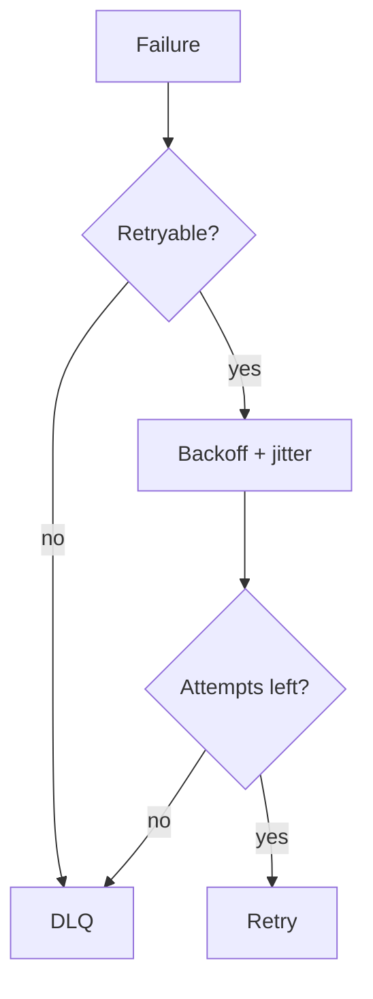

# Lesson 3.6 — Retry

**Module:** 03 — Enterprise Messaging  
**Duration:** 25–35 minutes  
**BayLearn philosophy:** WHY → WHEN → HOW. Pattern first. Technology second.

---

## Learning outcomes

By the end of this lesson you will be able to:

1. Distinguish retryable vs not (schema vs dependency).
2. Apply exponential backoff and jitter.
3. Cap retries before DLQ.

---

## Enterprise scenario

An invalid JSON message was retried 10,000 times against a healthy worker. The queue never drained. Retry without classification is an outage amplifier.

> **Fiction notice:** Named companies in this course (Northbridge Bank, Harbor Retail, CareMesh Health, Atlas Manufacturing) are instructional fictions.

---

## WHY this exists

Retries exist because transient failures exist: network blips, throttling, downstream 503. Retries must not exist for poison: bad schema, authz denial, business rejection. Backoff prevents retry storms. Jitter prevents synchronized thundering herds. A max attempt count protects the platform.

---

## WHEN an Enterprise Architect uses it

- Transient dependency failure.
- Throttling (with respect for Retry-After).
- Unknown 5xx that your runbook marks retryable.

### When NOT to use it

- 4xx validation errors.
- Non-idempotent effects without keys.
- Unlimited immediate retries.

---

## HOW — the pattern (vendor-neutral)

Classify errors in the consumer. Retry transient with backoff+jitter. Send poison to DLQ quickly. Keep original payload and error reason. Align API-level retries (clients) with queue retries so you do not multiply (3 client retries × 5 queue retries × 4 Lambda retries).

### Architecture diagram

---

## HOW — AWS implementation (after the pattern)

SQS redrive, Lambda retry policies, AWS SDK default retries—**count them**. Lab 3 uses a redrive policy to DLQ. Module 11 expands jitter math.

Do not start here. If you cannot explain the requirement and pattern without naming an AWS service, you are not ready to select technology.

---

## Anti-patterns

- Retrying 400s.
- Sleep(1) in a hot loop without a cap.

---

## Tradeoffs

| Dimension | Benefit | Cost / risk |
|-----------|---------|-------------|
| Aggressive retry | Survives blips | Amplifies outages |
| No retry | Simple | Fragile to transients |

---

## Architecture decision prompt

If both the SDK and SQS retry, how do you compute worst-case duplicate side-effect attempts?

Write four sentences: the requirement, the integration characteristics, the pattern, and why the rejected options fail the NFRs.

---

## Knowledge check

**Q1.** Why jitter?

*Answer.* To desynchronize retrying clients so they do not hit the dependency in lockstep.

---

## Architect's note

Draw the retry graph. If it is a tree that explodes, you designed an outage.

---

## Next

Complete any architecture challenge attached to this lesson in the course player. Record an ADR fragment if the decision would survive a design review.
