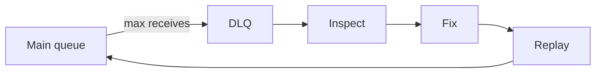

# Lesson 3.7 — Dead Letter Queues

**Module:** 03 — Enterprise Messaging  
**Duration:** 25–35 minutes  
**BayLearn philosophy:** WHY → WHEN → HOW. Pattern first. Technology second.

---

## Learning outcomes

By the end of this lesson you will be able to:

1. Use a DLQ as a controlled failure bucket, not a trash can.
2. Require inspection, fix, and replay.
3. Alert on DLQ depth as a customer-impact metric.

---

## Enterprise scenario

Payments silently “succeeded” because failures went to a DLQ nobody watched. Reconciliation found them on Friday. A DLQ without an owner is loss with extra steps.

> **Fiction notice:** Named companies in this course (Northbridge Bank, Harbor Retail, CareMesh Health, Atlas Manufacturing) are instructional fictions.

---

## WHY this exists

A dead letter queue holds messages that exceeded retry policy. It preserves evidence: payload, approximate receive count, error context. The operating model is: alert, diagnose, fix code or data, replay, confirm drain. Some messages are permanently invalid and must be compensated in the business (contact the partner), not infinitely replayed.

---

## WHEN an Enterprise Architect uses it

- Any queue that can poison or exhaust retries.
- Any pipeline with a human-impacting failure.

### When NOT to use it

- As long-term storage.
- As a way to ignore errors.
- Without IAM so everyone can purge production evidence.

---

## HOW — the pattern (vendor-neutral)

Attach DLQ with maxReceiveCount appropriate to transient vs poison (often 3–5). Encrypt it. Restrict purge. Build a replay tool that re-sends to the main queue with audit. Include DLQ depth on the ops dashboard (Module 13). Lab 3 forces you through inspect → fix → replay.

### Architecture diagram

---

## HOW — AWS implementation (after the pattern)

SQS redrive to DLQ; Lambda onFailure destinations; EventBridge DLQs. The service name changes; the operating model does not.

Do not start here. If you cannot explain the requirement and pattern without naming an AWS service, you are not ready to select technology.

---

## Anti-patterns

- Purging DLQ to “go green.”
- Same alarm threshold as the main queue (too late).

---

## Tradeoffs

| Dimension | Benefit | Cost / risk |
|-----------|---------|-------------|
| DLQ | No silent loss; room to fix | Requires ops discipline |
| Drop on failure | Clean queues | Silent business loss |

---

## Architecture decision prompt

A message in DLQ is schema-invalid. Should you replay it before or after deploying a parser fix—or never, and notify the partner?

Write four sentences: the requirement, the integration characteristics, the pattern, and why the rejected options fail the NFRs.

---

## Knowledge check

**Q1.** What are the three operational steps after a DLQ alert?

*Answer.* Inspect (root cause), fix (code/data/IAM), replay (or compensate) with audit.

---

## Architect's note

Capstone 1 requires replay. Practice it in Lab 3 until it is boring.

---

## Next

Complete any architecture challenge attached to this lesson in the course player. Record an ADR fragment if the decision would survive a design review.
