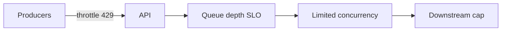

# Lesson 3.8 — Back Pressure

**Module:** 03 — Enterprise Messaging  
**Duration:** 25–35 minutes  
**BayLearn philosophy:** WHY → WHEN → HOW. Pattern first. Technology second.

---

## Learning outcomes

By the end of this lesson you will be able to:

1. Explain back-pressure as protecting the downstream instead of infinite buffering.
2. Use queue depth, concurrency limits, and 429s as controls.
3. Know when buffering hides a systemic overload.

---

## Enterprise scenario

Checkout scaled to 10,000 TPS. Inventory workers were 50 TPS. The queue grew for three hours. Every order looked “accepted.” Then warehouse SLA died. Buffering without a policy is a delayed outage.

> **Fiction notice:** Named companies in this course (Northbridge Bank, Harbor Retail, CareMesh Health, Atlas Manufacturing) are instructional fictions.

---

## WHY this exists

Back-pressure is how a system says “slow down.” In messaging, infinite queues postpone the truth. Architects set limits: max outstanding messages, consumer concurrency, producer throttling, load shedding with a user-visible degradation (queue the order, or refuse). The point is to fail in a **controlled** way.

---

## WHEN an Enterprise Architect uses it

- Any producer that can outrun consumers.
- Downstream systems with hard TPS or license limits.
- Batch windows that must finish by a clock time.

### When NOT to use it

- Unbounded queues as a personality trait.
- Hiding multi-hour lag behind 202 Accepted without a status UX.

---

## HOW — the pattern (vendor-neutral)

Define a lag SLO (for example, p95 time-in-queue). Alarm before the SLO. Autoscale consumers. If still behind, throttle producers (429) or shed load. For files, stop accepting the next file until the previous completes if that is the business rule.

### Architecture diagram

---

## HOW — AWS implementation (after the pattern)

SQS does not magically back-pressure producers. API Gateway throttles, Lambda reserved concurrency, and explicit queue-depth alarms implement it. ECS workers with scaling policies are an alternative for slow consumers.

Do not start here. If you cannot explain the requirement and pattern without naming an AWS service, you are not ready to select technology.

---

## Anti-patterns

- No max receive rate.
- Autoscaling that never catches a 100× producer.

---

## Tradeoffs

| Dimension | Benefit | Cost / risk |
|-----------|---------|-------------|
| Buffer | Smooth short spikes | Hides chronic overload |
| Shed load | Protects core | Requires a product answer for rejected work |

---

## Architecture decision prompt

If inventory cannot exceed 50 TPS by license, where do you enforce 50—at the worker, the queue, or the API?

Write four sentences: the requirement, the integration characteristics, the pattern, and why the rejected options fail the NFRs.

---

## Knowledge check

**Q1.** Is a growing queue always healthy elasticity?

*Answer.* No. After a lag SLO, it is an incident. Elasticity without a ceiling is a time bomb.

---

## Architect's note

Ask “what happens at 10× volume?” in every design review.

---

## Next

Complete any architecture challenge attached to this lesson in the course player. Record an ADR fragment if the decision would survive a design review.
