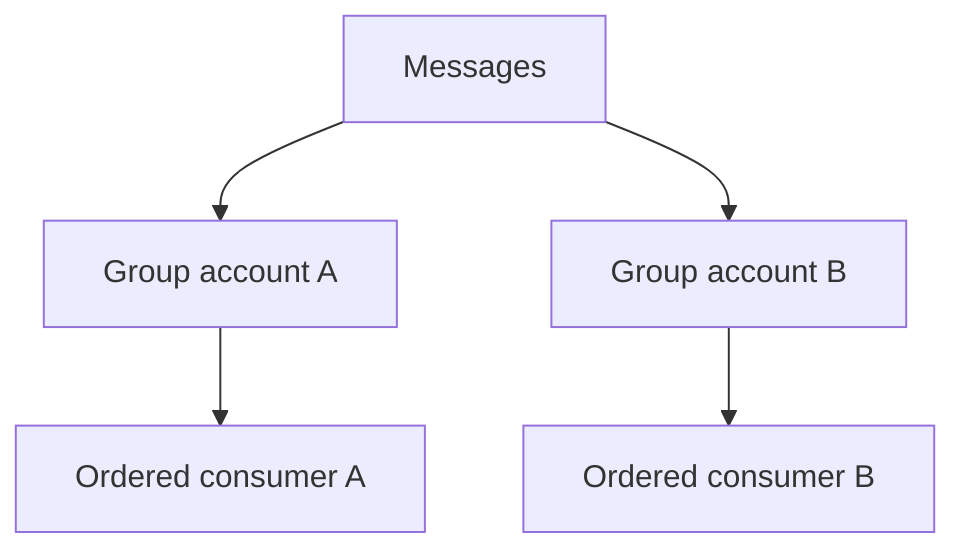

# Lesson 3.9 — FIFO Messaging

**Module:** 03 — Enterprise Messaging  
**Duration:** 25–35 minutes  
**BayLearn philosophy:** WHY → WHEN → HOW. Pattern first. Technology second.

---

## Learning outcomes

By the end of this lesson you will be able to:

1. Use FIFO when the business invariant is per-key ordering, not because it sounds safer.
2. Understand throughput and key design (message group ID).
3. Avoid global FIFO as a default.

---

## Enterprise scenario

Account postings for a single account must not apply a debit before the opening credit. Across different accounts, ordering does not matter. Global FIFO would throttle the bank for no reason.

> **Fiction notice:** Named companies in this course (Northbridge Bank, Harbor Retail, CareMesh Health, Atlas Manufacturing) are instructional fictions.

---

## WHY this exists

FIFO queues preserve order **per message group** and provide producer-side deduplication windows. They cost throughput and operational complexity. Most estates need per-entity ordering, not a single global sequence. If you can design commutative, idempotent events, you may not need FIFO at all.

---

## WHEN an Enterprise Architect uses it

- Per-aggregate invariants (account ledger, inventory SKU count with no commutative ops).
- Partners who cannot tolerate out-of-order files *and* you chose messaging rather than files.

### When NOT to use it

- High-throughput telemetry.
- Independent aggregates stuffed into one group ID.
- As a substitute for idempotency.

---

## HOW — the pattern (vendor-neutral)

Choose message group ID = the entity whose order matters (accountId). Keep groups numerous to preserve throughput. Document that FIFO ≠ exactly-once side effects. Consider whether a sequential store (ledger table with version) is a better invariant than the broker’s order.

### Architecture diagram

---

## HOW — AWS implementation (after the pattern)

SQS FIFO: 300 TPS default (batching higher), 5-minute dedupe. If you need more, you may have chosen the wrong grouping—or you need a different architecture (sharded ledgers). Do not FIFO the entire enterprise bus.

Do not start here. If you cannot explain the requirement and pattern without naming an AWS service, you are not ready to select technology.

---

## Anti-patterns

- One group ID for the company.
- FIFO plus a non-idempotent handler.

---

## Tradeoffs

| Dimension | Benefit | Cost / risk |
|-----------|---------|-------------|
| FIFO per key | Preserves local invariants | Throughput and stuck-group risk |
| Standard + version checks | Scale | Must reject stale versions in the app |

---

## Architecture decision prompt

If group ID is always “ORDERS”, what happens to throughput and blast radius?

Write four sentences: the requirement, the integration characteristics, the pattern, and why the rejected options fail the NFRs.

---

## Knowledge check

**Q1.** What sticks a FIFO group?

*Answer.* A poison message at the head of that group blocks later messages in the same group until it is handled.

---

## Architect's note

Stuck FIFO groups are a distinct incident type. Put them in the runbook.

---

## Next

Complete any architecture challenge attached to this lesson in the course player. Record an ADR fragment if the decision would survive a design review.
